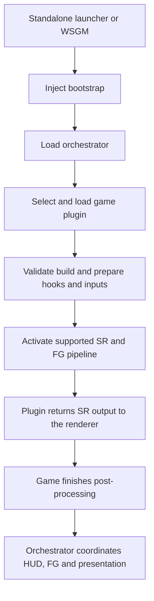

# ReScaleFrame

A framework for reverse engineering games to add modern upscaling and frame generation.

ReScaleFrame is a KillerPixelCrew project. Its first target is **Ace Combat 7 on Windows, with XeSS Super Resolution, Multi Frame Generation, and XeLL on Intel Arc handhelds**. DLSS and FSR belong in the same shared runtime. Standalone use and WSGM per-game profiles are both part of the design.

**Status: initial scaffold.** The native components build, the AC7 plugin recognizes the researched executable fingerprint, and the egui status panel compiles. Injection, renderer hooks, SR, FG, and in-game UI rendering are not implemented yet. Recognizing a game build does not mean rendering support is available.

## One repository

All first-party components live here and evolve together. Separate DLLs and interfaces keep ownership clear without splitting development across repositories.

| Directory | Responsibility |
| --- | --- |
| `apps/launcher` | Standalone launch and profile frontend |
| `loader` | Injected bootstrap and future loading mechanisms |
| `runtime/orchestrator` | Configuration, lifecycle, game plugins, and pipeline coordination |
| `runtime/backends` | Intel, NVIDIA, and AMD integrations |
| `runtime/graphics` | Resource handling, API interoperability, and presentation |
| `sdk/game` | Native C contract shared with game plugins |
| `games/ac7` | AC7 identification, hooks, and renderer integration |
| `ui/overlay` | Rust egui frontend for the in-game settings surface |
| `integrations/wsgm` | WSGM launch/profile integration |
| `tests` | Native ABI and plugin contract checks |
| `tools` | Read-only inspection utilities |
| `docs` | Architecture, implementation plan, and research |

## Loading and rendering



The orchestrator loads before it activates the graphics pipeline. The game plugin knows the engine and hook sites; the orchestrator owns the vendor SDKs and presentation. The launcher and WSGM exchange settings and status with the in-game runtime.

## Build

Requirements: Windows x64, Visual Studio 2022 C++ build tools with a Windows SDK, CMake 3.25 or later, and Rust 1.94.1. The Rust toolchain is pinned in `rust-toolchain.toml`.

```powershell
./eng/verify.ps1
```

This builds the native scaffold, runs its contract checks, and checks/formats the Rust workspace. It does not launch or inject into a game. Native output goes to `build/windows-x64/bin/Debug` by default.

For just the native components:

```powershell
cmake --preset windows-x64
cmake --build --preset windows-debug
ctest --preset windows-debug
```

For the design and next work, start with [the design](docs/design.md), [the implementation tracker](docs/implementation.md), and [the AC7 hook map](docs/research/ue418-hook-map.md). [Presentation backends](docs/research/presentation-backends.md) explains the Vulkan and DX12 options.

Reference projects, Epic engine source, game binaries, and vendor runtime DLLs are not included. Inspected revisions and links are in [the source map](docs/research/source-map.md). See [dependencies](docs/dependencies.md) before adding third-party code or binaries.

## License

ReScaleFrame's runtime, loader, launcher, UI, game plugins, tools, and documentation use [GPL-3.0-only](LICENSE). The Game SDK under `sdk/game/` uses [MIT](sdk/game/LICENSE). Third-party dependencies retain their own licenses.
