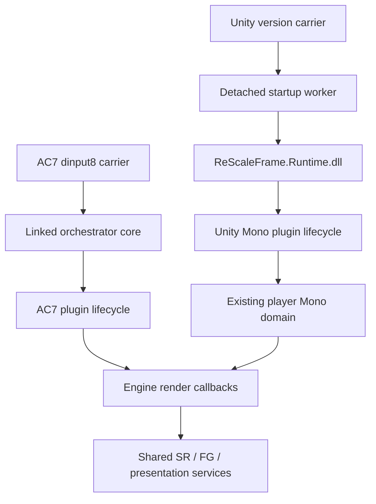

# Repository code reference

This guide maps the current first-party source, build files and developer workflows. Public
headers define the callable contracts; component READMEs explain local implementation details.
The [current status](current-status.md), [implementation tracker](implementation.md) and
[research index](research/README.md) record
what was built, exercised on a device, observed in a game or accepted visually. Source coverage
and documentation changes do not extend those results.

## Repository map

| Area | Responsibility and entry points |
| --- | --- |
| [loader](../loader/README.md) | Game-facing DLL carriers, forwarding, configuration and startup glue; optional module/frame capture in `loader/diagnostics`. |
| [Game SDK](../sdk/game/README.md) | MIT C ABI for plugin discovery, lifecycle, native render passes, CPU events and frame metadata. |
| [game integrations](../games/README.md) | Build fingerprints, guarded engine hooks, producer conventions and output reinsertion. AC7 and Unity Mono have implementations; Project Wingman is an inactive scaffold. Drag'n Wash records the Unity adapter's first game evidence. |
| [orchestrator](../runtime/orchestrator/README.md) | Plugin/provider sessions, source-frame ledgers, input normalization, history, SR/FG routing, settings and overlay hosts. |
| [backend contract](../runtime/contract/include/rescaleframe/backend.h) | Vendor-neutral capabilities, resources and SR tables; `negotiate.cpp` selects routes from supplied capability facts. |
| [vendor adapters](../runtime/backends/README.md) | C++ DLSS/Streamline, FidelityFX and XeSS/XeFG/XeLL implementations; `rsf-upscaler` is a pure Rust quality/motion model. |
| [graphics](../runtime/graphics/README.md) | D3D11 observation, shadow bindings, state save/restore, decode/resolve, colour transport, composition, resource retention and diagnostic readback. |
| [presentation](../runtime/presentation/include/rescaleframe/d3d11_present_bridge.h) | Stable game-facing DXGI facade, shared surfaces/fences and replacement of the physical presentation provider. |
| [overlay](../ui/overlay/README.md) | Rust/egui model, controls and meshes behind a C ABI; GPU/input handling remains in the native host. |
| [launcher](../apps/launcher/src/main.cpp), [WSGM](../integrations/wsgm/README.md) | Launcher help/version scaffold and WSGM design documentation. Launch/injection and frontend IPC are not implemented. |
| [tests](../tests/README.md) | C/C++/managed fixtures, compile-only ABI targets, synthetic graphics paths and explicit hardware experiments. |
| [tools](../tools/README.md) | Offline executable, reflection, capture and view-buffer analysis; AC7 packaging; [Ghidra helpers](../tools/ghidra/README.md). |
| [engineering scripts](../eng/README.md) | Verification, build, explicit deployment/package workflows and an isolated Wine graphics prefix. |
| [documentation](README.md) | Current developer navigation, design/plans, acceptance tracker, dependency terms, release instructions and dated research/evidence. |
| [repository guidance](../AGENTS.md) | Ownership, ABI and evidence rules. `CLAUDE.md` links the same instructions; `.agents/skills` contains reusable renderer-analysis procedures and agent metadata. |

Game binaries, vendor checkouts, licensed engine source, captures, decompiles and Ghidra projects
stay outside the tracked tree. The ignore rules reserve `.local`, `references`, `vendor`,
`captures`, `dumps` and `ghidra_projects` for those inputs and generated research artifacts.
The root [LICENSE](../LICENSE) covers first-party code except the separately licensed
[Game SDK](../sdk/game/LICENSE). Vendor redistribution terms are in [dependencies](dependencies.md).

## Build and configuration

Native CMake, Rust/Cargo and the Unity managed project are distinct build graphs. CMake does not
build the Rust overlay or the managed helper automatically. Deployment helpers assemble the
matching artifacts after their individual builds.

| File/category | Role |
| --- | --- |
| [CMakeLists.txt](../CMakeLists.txt) | Windows x64 guard, C11/C++20, generated version, warnings-as-errors interface, pinned MinHook FetchContent and native subdirectories. `BUILD_TESTING` adds fixture targets. |
| Component `CMakeLists.txt` files | Include paths, public/static library aliases, DLL outputs, optional SDK header gates and platform links. The orchestrator OBJECT library supplies the same compiled runtime code to the DLL and AC7 carrier. |
| [CMakePresets.json](../CMakePresets.json) | Windows VS 2022/2026 and Linux MinGW configure/build/test presets. Both Windows generators use `build/windows-x64`; select the generator appropriate to that build tree. |
| [MinGW toolchain](../cmake/toolchains/mingw-w64-x64.cmake) | Windows target triple, cross-compiler/search paths and an available Wine executable as CTest emulator. |
| [VERSION](../VERSION), [version.h.in](../cmake/version.h.in) | CMake project version and generated `rescaleframe/version.h`; generated storage supplies DLL/launcher version strings. |
| [Cargo.toml](../Cargo.toml), [Cargo.lock](../Cargo.lock) | Shared version, Rust edition/MSRV, lint policy and pinned dependencies for `ui/overlay` and `runtime/backends/rsf-upscaler`. `egui` is pinned in the workspace. |
| [rust-toolchain.toml](../rust-toolchain.toml) | Rust 1.94.1 plus rustfmt/Clippy. `VERSION` and the workspace package version must agree. |
| [managed project](../games/unity-mono/managed/ReScaleFrame.Unity.Managed.csproj) | `netstandard2.1`, locked Harmony dependency and locally supplied matching Unity reference assemblies. `Directory.Build.props` keeps intermediates under `build/managed`. |
| Managed `packages.lock.json` | NuGet resolution for the helper. The test project separately targets CoreCLR and the Mono-compatible API surface. |
| [verify workflow](../.github/workflows/verify.yml) | Windows 2022 CI calls the Release native/format/lint gate with pinned checkout action. It does not supply game acceptance or local vendor DLLs. |
| [.editorconfig](../.editorconfig), [.gitattributes](../.gitattributes) | UTF-8/LF, indentation and tracked text/binary handling. |
| [.gitignore](../.gitignore) | Generated native/Rust/managed outputs and local research/dependency material. |
| [.mcp.json](../.mcp.json) | Development Ghidra MCP bridge configuration; it is not loaded by the game runtime. |
| Game `engine.json` files | Exact build identity and evidence summaries. They document research rather than define the runtime plugin allowlists. |
| [INI sample](../loader/ReScaleFrame.ini.sample) | Initial/advanced carrier settings. Runtime settings and per-user preference storage are handled by the native hosts. |

The native preset map is:

| Configure preset | Build/test presets | Toolchain/output |
| --- | --- | --- |
| `windows-x64` | `windows-debug`, `windows-release` | VS 2022 x64, `build/windows-x64`. |
| `windows-x64-vs18` | `windows-debug-vs18`, `windows-release-vs18` | VS 2026 x64, same native build directory. |
| `linux-cross-x64` | `linux-cross-debug`; test-only `linux-cross-dxvk` | MinGW-w64, `build/linux-cross-x64`; DXVK test preset selects `.local/wine-test-prefix` and native graphics overrides. |

Most native binaries use `bin/<Config>` for multi-configuration Windows builds. The dedicated
AC7 carrier uses `build/windows-x64/ac7/bin/<Config>`; FG graphics fixtures use an isolated
`build/windows-x64/fixtures/fg/<Config>` directory to avoid loading adjacent game-facing proxy DLLs.
Cargo outputs use `target`, and packaging writes separate release/staging directories.

| Artifact/target | Current role |
| --- | --- |
| `ReScaleFrame.Bootstrap.dll` / `rsf_bootstrap` | Version-only bootstrap scaffold. |
| `ReScaleFrame.Runtime.dll` / `rsf_orchestrator` | Shared runtime DLL; Unity loads it explicitly. |
| `ReScaleFrame.Game.AC7.dll`, `.ProjectWingman.dll`, `.UnityMono.dll` | Game SDK plugin lifecycle DLLs with their own detection/preparation contracts. |
| `dinput8.dll` / `rsf_proxy_ac7` | Dedicated AC7 DirectInput carrier and linked runtime core. |
| `dinput8.dll` / `rsf_proxy_dinput8`; copied `ReScaleFrame.Loader.dll` and `carriers/version.dll` | Generic MSVC carrier with DirectInput and version forwarding. |
| `rescaleframe_overlay.dll` | Cargo-built Rust panel/HUD DLL loaded through `overlay.h`. |
| `ReScaleFrame.exe` / `rsf_launcher` | Help/version frontend scaffold. |
| `ReScaleFrame::GameSDK` | CMake INTERFACE target; public headers with no SDK DLL. |

Optional cache paths are declared where consumed: `RSF_STREAMLINE_INCLUDE`, `RSF_FFX_INCLUDE`,
`RSF_XESS_INCLUDE`, `RSF_UNITY_NATIVE_INCLUDE`, and optional NVAPI/RenderDoc/NGX probe headers.
Missing vendor headers preserve callable refusal implementations. Installed headers enable
compilation; deployed DLLs, queried SDK versions and actual devices determine execution support.
See [dependency configuration](dependencies.md) rather than assuming build capability implies
runtime availability.

## Loading and plugin activation

The actual carriers have two routes:

The [bootstrap export](../loader/src/bootstrap.cpp) and
[runtime version export](../runtime/orchestrator/src/runtime.cpp) return version metadata.
The implemented loading paths are in the carrier and plugin-session code described below.

For AC7, [dinput8_proxy.c](../loader/proxy/src/dinput8_proxy.c) forwards `DirectInput8Create`,
reads startup settings and starts its worker. The worker waits for decrypted executable sites
before guarded engine preparation. `rsf_bridge_prepare_game` in
[dlss_bridge.c](../loader/proxy/src/dlss_bridge.c) supplies host callbacks to the shared plugin
session. Once presenting device/output dimensions and an SR path are ready, bridge startup
activates the plugin. The carrier still owns compatibility discovery, maintenance and overlay
glue; AC7 engine addresses and native resource decisions are implemented under `games/ac7`.

For Unity, [shim_loader.cpp](../loader/proxy/src/shim_loader.cpp) implements generic `version.dll`
startup and lazy forwarding to the system DLL through
[version_forwarders.asm](../loader/proxy/src/version_forwarders.asm). The worker uses
`rsf_unity_fg_start` before graphics-chain creation, waits for the player's Mono runtime, then
calls `rsf_unity_sr_start`. [unity_sr_host.cpp](../runtime/orchestrator/src/unity_sr_host.cpp)
prepares/starts the plugin; graphics-provider initialization waits for its real render callback.
The worker and version forwarding stay usable independently. Carrier export names/ordinals are
specified by [shim_exports.def](../loader/proxy/src/shim_exports.def) and
[ac7_exports.def](../loader/proxy/src/ac7_exports.def).

The shared [plugin-session contract](../runtime/orchestrator/include/rescaleframe/plugin_session.h)
loads the requested module, resolves `rsf_get_game_plugin_api`, detects the exact probe, and calls
`prepare -> start -> quiesce -> stop`. Size/version checks precede field access. Plugins copy the
host callback table during preparation; the host retains callback functions and `user` storage
until stop succeeds. A busy stop preserves the module and storage for retry.

[game_api.h](../sdk/game/include/rescaleframe/game_api.h),
[game_renderer.h](../sdk/game/include/rescaleframe/game_renderer.h) and
[game_frame.h](../sdk/game/include/rescaleframe/game_frame.h) define fixed-width records,
opaque identities, borrowed strings and leased resources. No STL/Rust container, exception or
ownership-ambiguous allocation crosses the boundary. Extend records by appending fields and
updating the applicable ABI. Game and frame ABIs are separately versioned.

## Engine producers and SR execution

AC7's [plugin](../games/ac7/src/plugin.cpp) owns lifecycle admission.
[native_renderer.cpp](../games/ac7/src/native_renderer.cpp) validates researched instruction bytes,
prepares renderer-owned view sizes, inserts native SR graph work and preserves spatial fallback.
[render_scope.cpp](../games/ac7/src/render_scope.cpp) attaches copied pass/frame metadata and
resource leases to queued execution markers. CPU construction can finish before those commands
execute; the execution callback must receive the original identity and retained resources.

The AC7 producer also owns its [view-uniform reader](../games/ac7/src/view_uniforms.cpp),
[UI classification](../games/ac7/src/ui_rules.cpp),
[scene-colour selection](../games/ac7/src/scene_color.cpp),
TrueSky [depth](../games/ac7/src/truesky_depth.cpp)/[motion](../games/ac7/src/truesky_motion.cpp)
and [contact-shadow shader correction](../games/ac7/src/contact_shadow.cpp).
Those implementations use AC7-specific evidence and guards. Their historical findings remain in
[the hook map](research/ue418-hook-map.md) and dated research.

Unity's [native bridge](../games/unity-mono/src/bridge.cpp) and
[Mono embedding adapter](../games/unity-mono/src/mono_runtime.cpp) attach to the player's existing
identified scripting domain. They do not create another game Mono runtime. The managed
[Bootstrap](../games/unity-mono/managed/Bootstrap.cs) defers Unity object access to the main-thread
render loop; [UrpAdapter](../games/unity-mono/managed/UrpAdapter.cs) preflights exact metadata
contracts before Harmony patches. It chooses eligible cameras, records same-frame inputs and
replaces incoming HDR scene colour at post-processing entry, leaving the engine's spatial route
available when reconstruction refuses. [CpuBoundaries](../games/unity-mono/managed/CpuBoundaries.cs)
records native source identity around the player loop.

RenderGraph handles become native resources during execution, not during metadata collection.
[Native.cs](../games/unity-mono/managed/Native.cs) matches the
[unity_bridge.h](../games/unity-mono/include/rescaleframe/unity_bridge.h) packet layout. The bridge
leases packet resources through queued native events and Unity/GPU completion; admission closes
before managed/native teardown. The initial adapter restricts player/pipeline/API/camera shapes;
recognizing a Unity executable does not authorize arbitrary Unity versions or pipelines.

Shared processing then follows the producer's execution boundary:

1. Validate frame/view/generation and render/output rectangles. Normalize game depth/motion,
   exposure and colour conventions in [native_sr.cpp](../runtime/orchestrator/src/native_sr.cpp)
   or [native_sr_d3d12.cpp](../runtime/orchestrator/src/native_sr_d3d12.cpp).
2. Use the SDK's plan for input dimensions. Direct [sr_session](../runtime/orchestrator/include/rescaleframe/sr_session.h)
   consumes prepared D3D12 inputs; [sr_bridge](../runtime/orchestrator/include/rescaleframe/sr_bridge.h)
   transfers same-adapter D3D11 resources and orders the return copy.
3. Evaluate the selected vendor. Keep pre-tonemap SR colour separate from completed-frame FG
   inputs. Preserve explicit jitter, exposure, depth and world-unit conventions with the record.
4. Copy accepted output into the engine-owned destination before its downstream postprocessing.
   Preserve fallback on refusal, and restore all affected graphics state before returning.

Prepared direct SR uses dense previous-minus-current motion in render pixels. Game passes carry
explicit native motion-to-UV conversion and coverage facts; sparse vectors can still require
camera reconstruction from depth/reprojection. [motion_decode](../runtime/graphics/include/rescaleframe/motion_decode.h),
[motion_resolve](../runtime/graphics/include/rescaleframe/motion_resolve.h),
[colour_transport](../runtime/graphics/include/rescaleframe/colour_transport.h) and
[native_translucency](../runtime/orchestrator/include/rescaleframe/native_translucency.h) define the
corresponding reusable transforms. Input dimensions and valid rectangles are separate from padded
allocation sizes.

The compatibility [dlss_pipeline](../runtime/orchestrator/include/rescaleframe/dlss_pipeline.h)
still owns process-wide D3D11 processing/history and alternate SR selection. The private legacy
adapter translates that path into shared SDK records. AC7 compatibility reinsertion uses
[frame_tap](../runtime/graphics/include/rescaleframe/frame_tap.h) and
[scene_promote](../runtime/graphics/include/rescaleframe/scene_promote.h); native engine insertion
uses the leased graph/pass path. Their existence does not establish equivalent game coverage.

## Frame identity, synchronization and presentation

The important identities have different owners and meanings:

| Identity | Meaning and consumer |
| --- | --- |
| `session_id` | Host/plugin run; isolates live records from another lifecycle. |
| `source_frame_id` / SDK `frame_id` | Application input/simulation source identity carried through rendering and Present. Generated images do not advance it. |
| `native_frame` | Engine rendering counter copied with a pass; it alone does not establish CPU or Present association. Native D3D12 automatic FG capture currently uses this value, so its producer must align it with the CPU/window source ID. |
| `submission_id` | Unique lifetime ticket for one queued renderer submission; several submissions/views may share a source frame. |
| family/view/history/pass/scope keys | Opaque engine owners and temporal/execution associations; the host must not dereference them. |
| `resource_generation` | Surface/context rebuild identity; stale resources must not reuse current frame history. |
| presentation generation | Physical provider lifetime used by pacing/marker wrappers to reject calls racing a switch. |

[render_links](../runtime/orchestrator/include/rescaleframe/render_links.h) retains bounded
CPU-to-queued-render tickets. [native_cpu](../runtime/orchestrator/include/rescaleframe/native_cpu.h)
collects copied real boundary events; its callbacks perform no graphics-context work.
[frame_sequencer](../runtime/orchestrator/include/rescaleframe/frame_sequencer.h) validates input,
simulation, render-submission and Present ordering. [native_scene](../runtime/orchestrator/include/rescaleframe/native_scene.h)
and [native_window](../runtime/orchestrator/include/rescaleframe/native_window.h) require matching
scene-surface, sampled/direct path, viewport/window and actual Present ownership.

D3D11 FG integration is in [native_fg.cpp](../runtime/orchestrator/src/native_fg.cpp);
[native_fg_d3d12.cpp](../runtime/orchestrator/src/native_fg_d3d12.cpp) handles native D3D12.
D3D12 capture records commands, while `rsf_fg12_submitted` separately confirms they reached the
owning queue. Screen/flag policy in `game_frame.h` is an eligibility gate; complete temporal inputs,
CPU/window matching and supported provider configuration are additional requirements.

[shared_surface](../runtime/presentation/include/rescaleframe/shared_surface.h) shares textures and
fences on the matching adapter. [d3d11_present_bridge.cpp](../runtime/presentation/src/d3d11_present_bridge.cpp)
exposes the stable game-facing chain while one physical provider owns presentation. D3D11 uses
shared uploads and a dedicated SR/upload queue; native D3D12 uses its engine queue and stable
facade buffers for runtime switching. Source callbacks exclude generated physical presents.

[fg_session](../runtime/orchestrator/include/rescaleframe/fg_session.h) probes/configures a provider,
quiesces host activity and replaces the physical chain only after retirement. A failed probe
preserves the active provider. Failure after detachment attempts plain recovery and records
whether presentation remains available. Request acceptance is not switch completion.
[fg_leases](../runtime/orchestrator/include/rescaleframe/fg_leases.h) keeps inputs alive until both
application submission and vendor retirement fences complete. Aborting CPU identity does not
release pending GPU work.

For SR replacement, open/plan the proposed provider before closing the active one. Reset history
after successful selection, discontinuities, refused frames, view/session changes and resource
rebuilds. D3D12 descriptor/allocator slots remain unavailable until caller-retired work completes;
`rsf_sr12_evaluate` records commands and changes list bindings rather than submitting/restoring
for the caller. A successful bridge evaluation queues its D3D11 output copy without promising
that the CPU has observed GPU completion.

The [live generation ABI](../runtime/contract/include/rescaleframe/frame_generation.h) is separate
from the older capability-only FG table in `backend.h`. DLSS shares one
[Streamline host](../runtime/backends/dlss/include/rescaleframe/streamline_host.h) for SR/FG and
Reflex/PCL registration, source-token lifetime and markers. FidelityFX and XeFG/XeLL own their
vendor-specific contexts, capability counts and retirement. Read statistics only when the
corresponding validity bit is set; activity, generated dispatch, SDK presents and physical
scanout are distinct facts.

## Overlay, settings and diagnostics

The [overlay C ABI](../ui/overlay/include/rescaleframe/overlay.h) separates draw/texture outputs,
native input/status and settings intents. Rust modules cover ABI/FFI checks, safe state, controls,
meshes and performance history. Calls on one handle stay on its owning thread. Draw arrays and
texture pixels borrow the handle until the next frame or destruction; texture-update descriptors
are copied into caller-owned arrays. Consume borrowed output before invalidation.

[overlay_host.cpp](../loader/proxy/src/overlay_host.cpp) resolves the overlay DLL, gathers window
input and draws against the presenting chain's device. Native [overlay_renderer](../runtime/graphics/include/rescaleframe/overlay_renderer.h)
performs D3D11 uploads/draws with saved state; [overlay_d3d12](../runtime/orchestrator/include/rescaleframe/overlay_d3d12.h)
uses the shared D3D11On12 route for D3D12. Texture updates precede draws and frees follow the last
use. Rust panic containment reports an invalid handle state that requires destruction; it relies
on unwinding. Shader mesh indices, premultiplied colour and physical-pixel clips are ABI contracts.

Insert controls publish intent; renderer-side boundaries apply quality/backend/enabled requests.
Hosts report requested/effective/active values separately. Carrier settings use the INI/environment
precedence documented in [loader setup](../loader/README.md). AC7 uses per-user preferences;
Unity preserves its independent deployment settings and FG preference file. A setting, selection
or counter alone does not prove provider activity or measured latency.

[loader diagnostics](../loader/diagnostics/include/rescaleframe/module_dump.h) provides module
snapshots, import/reference inspection and entropy; [frame capture](../loader/diagnostics/include/rescaleframe/frame_capture.h)
loads optional capture services. AC7 [motion_capture.cpp](../games/ac7/src/motion_capture.cpp)
records bounded shader/native/draw/dispatch/constants evidence and paired GPU data. Texture
readback lives in [texture_dump.h](../runtime/graphics/include/rescaleframe/texture_dump.h).
Copy callback-borrowed records immediately and hold resources at the actual consumption point;
retaining an allocation does not preserve its contents for another frame.

[tools/README.md](../tools/README.md) maps executable/reflection/view/capture analyzers and their
input/output assumptions. [Ghidra tooling](../tools/ghidra/README.md) maps offline type/FID/name
workflows. These are development tools, not runtime dependencies. Preserve partial capture files
as partial evidence and maintain the research notes/`engine.json` when new findings change a claim.

## Verification, deployment and extension points

The [engineering workflow guide](../eng/README.md) expands the arguments, artifacts and recovery
conditions for all seven scripts summarized below.

| Workflow | Source and boundary |
| --- | --- |
| Native and Rust lint gate | [eng/verify.ps1](../eng/verify.ps1): version agreement, selected native configure/build/CTest, Rust format and Clippy. `cargo test` is a separate operation. Routine verification does not deploy to a game. |
| Unity artifact build | [build-unity-sr.ps1](../eng/build-unity-sr.ps1): locked managed build against supplied Unity assemblies, native targets and Rust overlay. |
| AC7 runtime deployment | [deploy-ac7-sr-runtimes.ps1](../eng/deploy-ac7-sr-runtimes.ps1): validate supplied vendor DLLs/notices, backup/copy/hash-check, optional validation-only mode. |
| AC7 paired deployment | [deploy-ac7-proxy.ps1](../eng/deploy-ac7-proxy.ps1): build matching carrier/plugin/overlay, real-panel fixture in isolation, backups and deployment manifests. SDK and DLL-trio transactions have separate recovery boundaries. |
| Unity deployment | [deploy-unity-sr.ps1](../eng/deploy-unity-sr.ps1): exact researched build, existing artifacts, ownership/hash checks and original-file baseline. Backups support recovery; a failed copy sequence may leave a partial update. |
| Unity packaging | [package-unity-sr.ps1](../eng/package-unity-sr.ps1): verify deployed inputs, stage an allowlisted payload and record source/manifest/hash metadata. Replacement Release artifacts have their own validation status. |
| AC7 release packaging | [package-ac7.py](../tools/package-ac7.py): package binaries/source/notices with manifest hashes and pinned dependency checks. It operates on build/vendor inputs, not a game installation. |
| Wine graphics setup | [wine-test-prefix.sh](../eng/wine-test-prefix.sh): populate an explicit prefix from installed Proton graphics DLLs and set native overrides. It changes that prefix, not tracked source. |

The [fixture guide](../tests/README.md) maps every CTest registration and manual path. Compile-only
C targets check header compatibility. Synthetic providers isolate session/history/ownership
failures; WARP readback checks arithmetic. Several legacy graphics fixtures return success when
prerequisites are unavailable, so inspect their skip output before claiming graphics coverage.
Device and shipped-Mono fixtures require explicit local runtime/assembly inputs. No build/test
command in this guide records a new execution result.

When extending the repository, use the existing ownership boundary:

- A game adapter adds exact detection/evidence, producer settings, guarded hooks, copied frame/view
  identity and native reinsertion under `games`; it exposes the existing Game SDK lifecycle.
- A vendor implementation supplies the SR or live-generation table under `runtime/backends`.
  Build capability, runtime load failure, requested family/version and device refusal remain
  separate outcomes. Add negotiation policy under `runtime/contract` only when the contract changes.
- A graphics transform belongs under `runtime/graphics`; coordination/history belong under the
  orchestrator, and chain/fence interoperability belong under presentation. Document units,
  thread ownership, input/output states and the retirement condition at the public API.
- A UI feature adds model/control/intent/status fields and updates both native/Rust ABI sides.
  Apply graphics changes on the owning runtime boundary rather than inside the Rust panel.
- Frontend work builds on the launcher/WSGM boundaries when implemented. It exchanges bounded
  settings/status while the in-process runtime retains the per-frame graphics loop.

Use the [research methodology](research/methodology.md), [source map](research/source-map.md)
and applicable `.agents/skills` procedures for engine questions. Keep historical failures and
measurements intact, link new evidence from the tracker, and state the remaining validation
needed for the exact game/device path being changed.
