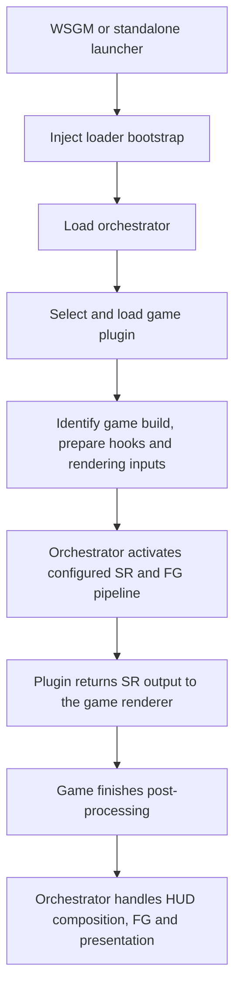

# ReScaleFrame design

ReScaleFrame adds modern upscaling and frame generation to existing games through engine-aware runtime integration. The initial complete target is Ace Combat 7 on Windows x64, with XeSS-SR, XeSS MFG, and XeLL on the MSI Claw 8.

## One monorepo, explicit responsibilities

The loader, orchestrator, Game SDK, game plugins, vendor backends, and UI live in this repository. They share a release version and can change together. Separate DLLs remain useful for loading and ownership; they do not require separate repositories.

| Component | Responsibility |
| --- | --- |
| Launcher / WSGM integration | Resolve the selected game and profile, arrange early loading, and manage the session |
| Loader bootstrap | Enter the target process and load the orchestrator at a safe boundary |
| Orchestrator | Own shared services, plugin lifecycle, vendor SDKs, frame/resource handling, settings, latency, and presentation |
| Game plugin | Recognize the game build, identify and prepare hooks, supply engine data, and put SR output back into the renderer |
| Game SDK | Define the native contract between orchestrator and game plugins |
| egui frontend | Present settings/status and send setting intents through the shared control contract |

## Loading flow

Loading the orchestrator is distinct from activating the pipeline. It first establishes configuration and shared services, then selects the game plugin and asks it to prepare the game. Graphics work starts only after the required hooks, resources, and capabilities are ready. The orchestrator owns initialization, recovery, and shutdown; the game plugin does not load a second runtime.

The plugin knows **where and how to hook the game**. The orchestrator knows **how to process the data using XeSS, DLSS, or FSR**. Game-specific signatures, structures, velocity encoding, camera resets, and HUD boundaries stay in the game plugin. Vendor contexts and swap-chain ownership stay in the orchestrator.

## Per-frame operation

1. The plugin supplies the real frame/input boundary and carries its frame identity through game/render/RHI handoffs.
2. At the temporal-processing boundary, it supplies scene colour, depth, motion, jitter, camera/exposure information, and valid rectangles.
3. The orchestrator executes SR and returns the reconstructed texture at that rendering boundary.
4. The plugin places the result back into the game's post-processing chain.
5. The game completes scene post-processing. The plugin supplies the final HUD-less scene and available UI/final-frame data in the correct order.
6. The orchestrator performs the chosen FG/UI composition and presentation with the matching frame ID and resource lifetimes.

SR input and FG HUD-less input are different points in the render pipeline. The pre-tonemap scene is not a substitute for the completed HUD-less image. Generated frames are not additional simulation frames.

## Graphics backends

Start with native DX11 XeSS-SR and a DX12 presentation bridge for XeSS MFG/XeLL. Keep graphics interoperability and presentation replaceable so Vulkan/DXVK can be evaluated without redefining the engine-data contract.

XeSS-SR supports Vulkan. Current native XeSS-FG/MFG and XeLL integration uses DX12. A Vulkan renderer with XeSS MFG would therefore require a mixed-API path until Intel supplies another native API. Backend choice should follow measured correctness, pacing, latency, and power use.

Only one provider owns FG/presentation at a time. Capabilities are queried from the actual adapter, driver, API, and SDK configuration. Stored settings express a request; the runtime reports what it can apply.

## Standalone and WSGM

Both frontends use the same runtime and game plugins. The standalone application supplies profile storage; WSGM uses its canonical per-application profile identity. Each session has one persistence authority, and IPC carries configuration/status rather than GPU textures.

The egui frontend renders through the game's existing window and graphics resources. Input ownership, controller navigation, graphics-state restoration, and keeping UI sharp across generated frames are part of the implementation.

## Detailed design and evidence

- [Architecture and native contracts](research/architecture.md)
- [Vulkan and DX12 presentation comparison](research/presentation-backends.md)
- [AC7 and UE4.18 hook map](research/ue418-hook-map.md)
- [Implementation acceptance criteria](research/validation-plan.md)
- [Pinned source references](research/source-map.md)
- [Implementation tracker](implementation.md)

The initial codebase is a scaffold. This design describes the intended runtime; it does not claim that injection, renderer hooks, or SR/MFG are implemented.
