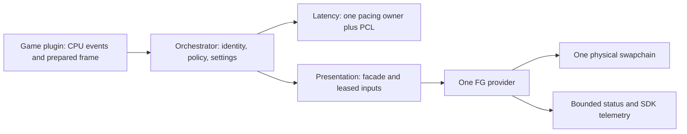

# Frame-generation orchestrator plan

30 September 2026. This document records the plan and source review. Subsequent implementation
and device lifecycle evidence are recorded in [the implementation notes](research/orchestrator-fg-implementation.md).
Those checks do not establish enabled FG, game visuals or measured latency.

This is the current FG/latency plan. It replaces the corresponding assumptions and milestones in
[the representation plan](representation-plan.md), while preserving that document's research trail.
The working [SR orchestrator](research/orchestrator-sr-switching.md) is the starting point.

## Scope and ownership

Build one reusable ReScaleFrame runtime for DLSS-FG, XeSS-FG, FSR3 FG and FSR4 FG, including supported
fixed MFG, DLSS Dynamic MFG, Reflex, XeLL and PCL telemetry. SR and FG are separate selections.

The orchestrator owns sessions, vendor SDKs, pacing selection, settings, frame sequencing and
presentation. Graphics/presentation code owns interop, copies, barriers, resource retirement and
the swapchain facade. A game plugin owns engine hooks, actual input/simulation boundaries, camera
and resource identification, screen classification, renderer preparation and reinsertion. The
frontends receive bounded commands and status, never textures or a per-frame graphics loop.

Shader replacement and motion-quality improvement are owned by the separately running agent.
This work consumes that output through a documented motion contract and tests its compatibility
with FG. It does not take ownership of shader replacement or duplicate that investigation.

## Feature versions and MFG

Package version, SR algorithm, FG algorithm and presentation implementation are separate fields.
Do not infer FG support or its multiplier from an SR choice or a DLL filename.

| Choice | Planned behavior |
| --- | --- |
| FSR2 | SR-only. Pair it with an independently selected FG provider; do not expose an invented FSR2 FG mode |
| FSR3 FG | Analytical interpolation; pinned SDK offers 3.1.6. Initial supported multiplier is 2x |
| FSR4 FG | ML interpolation, pinned version 4.0.1. Requires its own hardware/runtime query; no silent FSR3 substitution |
| DLSS-FG | Fixed generated count from `numFramesToGenerateMax`; generic count model supports values above 4x |
| DLSS Dynamic MFG | Offer only with `bIsDynamicMFGSupported`; SDK selects the count and ignores the fixed-count option |
| XeSS-FG / MFG | Query `maxSupportedInterpolations`; non-Intel GPUs are documented as limited to one generated frame |

For a fixed mode, `requested_generated = requested_multiplier - 1` and
`effective_generated <= supported_max` and any creation-time allocation ceiling. A 4x multiplier
means three generated frames and one source frame. Count clamping is reported explicitly.
Count changes, adaptive MFG, and increases requiring resource/chain recreation are distinct capabilities.

FSR3/FSR4 documentation describes a single intermediate frame. The FFX API's four output slots
are not evidence that every implementation supports MFG. Keep their initial maximum at one;
extend it only with a documented provider capability and device evidence. The runtime contract
remains able to represent larger counts without introducing a separate interpolation algorithm.

DLSS Dynamic mode has a requested display/custom FPS target and SDK-observed results, rather than
a fictional fixed effective multiplier. Record the effective display/VRR/VSync state and Reflex
limiter. Auto is a separate SDK mode: fixed-count interpolation that can disable itself based on
performance. Do not silently translate Dynamic into Auto or fixed On.

FSR4 FG requirements differ from FSR4 SR requirements. The current AMD FG guide requires Windows
11, an RX 9000-class GPU and a suitable D3D12/Agility runtime. Verify device/runtime compatibility
before creation. Existing SR success on Intel UHD or RTX 4070 does not establish FG or MFG support.

## What AC7 already provides

The root UI work was done. The classifier identifies the targets AC7's widget quads actually write;
`install_reinsert_plan` supplies those targets to `scene_promote`. Their replacements and scaled
viewports preserve an output-resolution game-owned UI layer, with the game's own recomposition,
effects and grading. This work was explicitly intended to prepare the UI input for FG.

The [UI correction](research/ac7-ui-extraction.md#the-correction-promote-the-interface-target-and-take-the-layer-from-there)
records measured premultiplied coverage. The [accepted result](research/ac7-consumer-session.md#accepted-result)
records the final upscaling/briefing result. Reuse this producer and the existing source evidence.

The earlier optional draw-diversion/Present-composition experiment is a different path. It changed
the color/glow/grade and is not the accepted basis for FG. Do not repeat it as a new extraction task.

Remaining work is to export a matching FG packet from the existing roots: final color, the UI layer
or coverage, and post-processed HUD-less color for the same source frame/view. Validate the export's
composition and lifetime. A texture reference alone neither preserves its contents nor proves that
its color space matches the final backbuffer. Preserve the game's processing after the root tap.

The first AC7 FG release targets eligible flight/replay frames. Menus, briefing, hangar, loading,
pause, video and unknown views remain suspended by default. This avoids treating every front-end
widget composite as an ordinary overlay; those scenes can be expanded through later evidence.

## Current profile and missing integration

| Surface | Current state / consequence |
| --- | --- |
| API / queue | AC7 D3D11 immediate-context integration; the runtime can create same-adapter D3D12 interop |
| SR | Native D3D11 DLSS, with new FSR/XeSS D3D12 reconstruction adapters and a synchronous transfer path |
| Streamline | 2.14.1 headers; current `rsf_dlss_load` initializes D3D11 and requests only DLSS-SR |
| FG providers | FSR/XeSS generation functions refuse; a DLSS FG provider is declared but not implemented |
| Presentation | Existing game swapchain/Present observer; no reusable FG-owned physical chain/facade yet |
| Public game ABI | ABI 1 metadata/detection; semantic frame/latency callbacks have not landed |
| Frame identity | Legacy evaluation counter/QPC timing is unsuitable as proof of input-to-present lineage |
| UI | Root layer identification/promotion and engine recomposition exist; paired FG exports remain unwired |
| Latency | No implemented Reflex/PCL/XeLL event or sleep integration; exact AC7 CPU sites require investigation |
| Settings | Insert overlay has SR choices; no implemented FG, MFG or latency controls |
| Validation | Synthetic SR and motion-resolve evidence exists; it is not FG, latency or new shader-quality evidence |

The synchronous `sr_bridge` is not a presentation bridge. Reuse shared-surface/fence primitives,
but build a leased asynchronous frame-transfer/present path. Normal frame processing must not
inherit unconditional CPU waits for all GPU work. Wait only for a slot or dependency that is still
in use; drain fully for ownership changes, resize, feature load/unload and teardown.

## Reusable interfaces to implement

Keep public native interfaces C ABI, size/version checked, append-only and ownership-explicit.
Implementation will bump the game ABI from 1 to 2, backend ABI from 2 to 3 and overlay ABI from 4
to 5 as their structures change. Extending the embedded frame/camera record also requires a frame
ABI bump; extending negotiation requests requires its registry ABI bump. Recheck current values
when parallel work is merged. Those are planned changes, not edits made by this document.

| Interface | Required additions |
| --- | --- |
| Host/plugin callbacks | Begin source frame before actual input; input kind/sample; simulation and render-submit spans; prepared resources; pre/post UI processing; resize and screen/reset events |
| Frame packet | App/session/view IDs, source/submission sequence, generation, provenance, camera and metric units, engine timing, valid rectangles and input-validity flags |
| FG selection / capabilities | Provider and feature-version IDs; fixed/adaptive modes; maximum count; runtime count-change and restart requirements; formats/UI modes; dependency and refusal reasons |
| FG provider | Prepare/configure, submit tags, present result, status and explicit input-retirement tickets; version information and asynchronous errors |
| Latency provider | Separate pacing owner and telemetry state; `sleep(frame_id)`, semantic markers at their actual boundaries, mode/limit application and status |
| Status | Requested/effective/active mode and counts; source/rendered/presented metrics with validity; SDK status, reset/refusal reason, queue/memory/copy cost and marker availability |

Do not use `RSF_LATENCY_PCL` as a pacing mode. PCL is telemetry; pacing is None, Reflex or XeLL.
Reflex mode is separately Off, On or On + Boost. Future Anti-Lag 2 support can add a pacing provider;
it is not a dependency invented for this initial implementation.

`rsf_fg_provider::latency_sleep` currently has no frame ID; `get_generated_count` cannot represent
unknown or aggregate-only telemetry; resources have no GPU-retirement ticket. Append suitable
operations/metadata rather than changing the meaning of existing signatures or counters.

## Frame and motion handoff

1. The plugin begins a real app frame at a verified CPU boundary. The runtime associates the
   frame with one Streamline token where needed. Sleep runs before that frame's input/simulation,
   after the required previous submission/present handoff, without a routine GPU-idle wait.
2. Emit actual input, simulation and render-submit events with that same identity. Preserve it
   through queued rendering. Record input kind and timestamps; never reconstruct these events
   afterward from Present counts or a key-polling worker.
3. The motion workstream supplies a matching resource and metadata: direction, units, dimensions,
   rectangle, jitter inclusion, camera inclusion, sentinel/validity, dilation and reset policy.
   The preferred neutral dense field is previous-minus-current displacement in render pixels.
   If its native output differs, agree one conversion owner before implementation.
4. Depth, motion, camera, scene/HUD-less color and UI must have the same source frame/view and
   known producer/last-write boundaries. Copy before overwrite and publish immutable leased data.
   Distinguish render-time depth/motion from the completed output-resolution color used for FG.
   Copy borrowed packet metadata into runtime-owned records; asynchronous SDK callbacks cannot
   retain plugin stack structures or assume borrowed texture contents are unchanged.
5. Shared Streamline SR/FG must use coherent scene constants, motion convention and a shared token.
   Refactor today's SR-owned token/constant creation into the Streamline host. Set scene constants
   once per frame/viewport; do not submit contradictory SR and FG camera-motion flags. A common
   dense input/conversion is the default solution, subject to motion-workstream validation.
6. Tag/prepare the completed packet and present through the selected real chain. Markers wrap
   that actual app Present call. Generated images do not create new engine-input or simulation IDs.
7. Retire slots only when all bridge and vendor consumers are finished. Advance a contiguous vendor
   submission ID where the SDK requires it; keep it separate from app IDs and physical output count.
   An error/gap resets history instead of reusing an ambiguous prepared ID.

Prove SDK token lifetime across CPU/render lag; do not assume a stored SDK pointer remains immutable
when later frames obtain tokens. Test the bounded in-flight window and 32-bit SDK-ID wrap mapping.
Mixed frame/view resources always refuse. Incomplete CPU lineage cannot claim complete latency
or satisfy a backend's mandatory marker integration.

Motion improvement has its own acceptance. FG integration tests check convention and frame
alignment, stationary jitter, camera pans/roll/cuts, independent aircraft/missile movement,
disocclusion, depth edges, transparency and extent changes. A passed presentation fixture must not
be reported as proof of the separate agent's shader-quality result.

## UI and resource leases

The neutral packet exposes the known final reference, HUD-less color and available UI color/alpha
with their actual transfer functions and formats. Backend adapters negotiate conversions; a common
RGBA8 UI texture is not automatically valid for every HDR/vendor mode.

Before accepting a separate-layer mode, validate `UI + (1 - alpha) * HUDless` against the game's
final output in the correct composition space, including glow, scene-dependent panels, reticle,
subtitles and color grading. If coverage alone or a final/HUD-less pair is the reliable export,
select a vendor mode supporting that representation and disclose its quality limits.

There is exactly one final UI composition for every output image. FFX can still composite a
registered UI texture with FG disabled: never feed an already UI-composited final image into that
path and then add the UI again. Define the Off/suspended source routing per backend as well.
The diagnostic overlay is included through the final UI route, outside scene inputs/history.

Use generation-stamped input leases with explicit vendor-retirement completion. A fixed two-slot
ring or the return from Present does not prove reuse is safe. Ring depth follows the measured
in-flight source frames and vendor retention, not blindly `1 + generated_count`. MFG output buffers
and source-input retention are different allocations; account for both and bound memory.

For DLSS-G, honor `inputsProcessingCompletionFence` when reusing input memory from the D3D11
producer or other non-presenting queues. For FFX, honor asynchronous composition/HUD-less retention
and documented internal UI buffering. For XeFG, use the documented ONLY_NOW or UNTIL_NEXT_PRESENT
resource contract plus required GPU completion. Async callbacks use immutable runtime-owned data
and their supplied D3D12 command list; they never touch the game's immediate context.

## SDK session, presentation and switching

FG-capable startup establishes one same-adapter D3D12 device/queue and one presentation owner.
Streamline supports one registered device and render API; initialize its D3D12 profile before its
feature/proxy operations. If DLSS-SR is selected in that profile it must use the same registered
D3D12 device. Moving it from the existing D3D11 path is a required compatibility task, not a new SR
feature. Keep current SR-only startup usable. A late request that cannot safely migrate returns
NEEDS_RESTART instead of silently creating a second Streamline runtime.

For native D3D12 games, use the supplied device/queue. For D3D11 games, intercept the eligible
swapchain creation early and return a stable D3D11-facing facade over runtime-owned resources.
Handle COM identity, backbuffer methods, resize, window state, present flags, TEST calls and waitable
objects. A secondary/tool chain is never captured as the game's main chain. SDK initialization and
graphics creation do not run under DllMain's loader lock.

If the game already owns a Streamline/latency integration, reuse a supported engine-wrapper
adapter or report an ownership conflict. Do not initialize a second instance, replace its identity,
or emit a second set of sleeps/markers. This must be part of the plugin's preparation profile.

Exactly one provider creates/wraps the physical chain. Do not nest FFX/XeFG proxies around a
DLSS-G proxy. Use the Streamline proxy/upgraded factory/device/queue path for DLSS-G and native
factory paths for the other providers, with SDK feature ownership explicitly transitioned.

Switch protocol: preflight runtime/device/version/options; suspend generation; quiesce app frames,
markers, callbacks and vendor presents; drain/release leases and backbuffer references; release the
old physical chain; create the replacement on the real window; restore state; warm up with fresh
inputs; then report active generation. Resize uses the same quiescent discipline and increments
generation. Queue/SDK errors transition to suspended or failed state with a reason.

This cannot copy SR's two-live-session transaction blindly. XeFG's documented descriptor-based
creation requires no existing swapchain on the window. Candidate preflight does not guarantee
activation. If activation fails after releasing the old chain, recreate a tested non-FG chain or
the previous provider; report the effective fallback. Prove this rollback before exposing switching.
If proxy isolation, Streamline feature reload or late takeover cannot be made safe, require restart.

`slSetFeatureLoaded` requires no concurrent DXGI/D3D/Vulkan calls, not just an empty presenting
queue. The plugin must expose a proven graphics-quiescence boundary covering its worker contexts
and resource creation as needed. A render-thread-only mutex is not proof of that condition.

For brief menu/reset suspension, retain the current provider safely and clear stale tags; do not
rebuild the physical chain on every cut. Persistent user-Off/provider changes use the SDK's clean
chain/feature teardown path, including DLSS-G's chain recreation to remove Off-mode proxy overhead.
Keep requested settings separate from suspended execution. Unknown/reset/missing-input frames
present a real frame without interpolation; resume only with validated contiguous fresh inputs.

## PCL, Reflex and XeLL

PCL markers are independent telemetry and remain available when the SDK supports them, regardless
of FG or Reflex user enablement. Query support instead of manually rejecting a GPU vendor. There
is one central marker stream; each enabled adapter maps semantic events explicitly.

The semantic order is input sample, simulation start/end, render-submit start/end, app Present
start/end. Validate ordering per frame while allowing different frames to overlap across threads.
Call markers at the real boundary; replaying queued markers later changes their timestamps.
`slPCLSetMarker` is documented thread-safe; SDK state/option/feature changes require owner-thread
serialization and the documented quiescence. Do not hold a global mutex across engine callbacks.

Streamline 2.14.1 deprecates `eInputSample = 6` and supplies `eControllerInputSample = 13`. Keep
the plugin's input event semantic, with input-device kind; map the controller marker only for real
controller sampling. Record unavailable SDK mappings honestly. Mouse/latency-ping paths follow
the current SDK guide and real verification messages. Do not cast marker 6 into the current enum
or invent a latency ping/flash event to make a checklist pass.

| Active pacing profile | Policy |
| --- | --- |
| Reflex | Apply Off/On/Boost and `frameLimitUs` at startup and changes. While loaded/supported, call `slReflexSleep` once per source frame with its token, including Off |
| DLSS-G | Requires effective Reflex low latency. Preserve the user's requested mode separately if FG requires it On; restore the request when the requirement ends |
| XeSS-FG | Requires XeLL. Disable other active latency-reduction systems; use XeLL sleep/markers and limiter with matching IDs, including its documented disabled/pass-through behavior |
| FSR FG | Supports an independently selected compatible pacing provider; no invented mandatory Reflex dependency. PCL may still collect telemetry |

Prove safe Reflex-to-XeLL feature transitions. A XeLL profile must unload/disable the conflicting
Reflex pacing feature at a quiescent boundary while retaining independent PCL. A loaded Reflex
profile cannot simply skip its Off-mode sleep requirement. Do not stack vendor sleepers. If a
supported safe feature transition cannot be established, require a profile restart.

Use one pacing/limiter policy. XeLL requires competing latency solutions disabled and, with low
latency + VSync, sync interval 1. DLSS Dynamic MFG expects the Reflex limiter. Observe actual
game/driver present and limiter state after saved settings settle; report unknown driver overrides
instead of claiming they are absent. Document each game limiter intervention at its owning root.

## Telemetry and runtime distribution

Track requested provider/version/mode/count, effective configuration, actual eligibility and SDK
activity separately. Record warm-up, skips, drops, reset causes, asynchronous errors, present state,
source rate and displayed cadence, CPU/GPU cost and input-retirement pressure.
Label SDK-reported latency separately from a physical input-to-photon measurement; marker deltas
and a higher displayed frame rate do not establish the latter.

DLSSGState's `numFramesActuallyPresented` counts presented frames since the preceding query; it
is not a generated-only counter. One owner polls and snapshots it. XeFG has last-present status;
FFX callbacks identify generated images. Expose only statistics each adapter can establish, with
validity flags and interval/ID provenance. Do not subtract arbitrary app Present calls to fabricate
a generated-frame count. Display rate is not input latency.

Production uses signed retail runtimes, verified identity/setup, bounded logs and no development
watermark/debug configuration. Development mode selects explicit SDK debug runtimes/config only
when available. Package paths and license notices are distinct from SDK header/source availability.

Local inspection found the Streamline interposer/common/DLSS-G/Reflex/PCL and `nvngx_dlssg` DLLs,
FFX loader/frame-generation DLLs, XeFG/XeLL DLLs, and SDK ReflexTest/PrintPCL tooling. No FG feature
load/state or verification-tool run had been performed at planning time. The initial loader
assumption was corrected by the subsequent [device lifecycle experiment](research/orchestrator-fg-implementation.md):
direct signed FG DLL loading enumerates and creates the versioned FG/swapchain contexts. Required
version descriptors and explicit provider queries remain necessary. Dependency failures preserve SR settings and ordinary presentation; SR remains
active only if its own runtime dependencies are available. Report a shared-runtime loss explicitly.

## Implementation sequence and acceptance

| Milestone | Deliverable and exit evidence |
| --- | --- |
| FG0: SDK/ownership experiments | Off-only D3D12 presentation fixture; creation timing, window ownership, SL device/proxy isolation and feature reload; FFX version enumeration; XeFG/XeLL dependency and retirement. Publish measured limits before claiming hot switching |
| FG1: runtime identity and plugin ABI | Fixed session, semantic CPU/GPU callbacks and token ownership. Deterministic threaded/gap/wrap/refusal tests; exact AC7 CPU hook sites found against matching source/runtime, with expected bytes and research |
| FG2: root-input export | Reuse promoted AC7 UI roots; matching final/HUD-less/UI packet, copy-before-overwrite and composition equivalence. Consume the motion agent's contract/evidence. Separate synthetic checks from game captures |
| FG3: presentation foundation | Stable facade and plain D3D12 inner chain; asynchronous transfer/leases, TEST and present-index behavior, resize, rollback and device loss. Native Windows pixel/fence fixtures; SR regression |
| FG4: PCL and pacing | Independent PCL; Reflex Off/On/Boost and XeLL profiles at actual hooks. SDK tools verify sleep counts, timestamps/IDs/order and reports; incompatible limiter/profile transitions are refused |
| FG5: FSR3 FG baseline | Loader, versioned FG/swapchain contexts, PrepareV2, UI strategy and callbacks. Real-scene 2x activity, capture, pacing and Off/unsupported/missing-runtime/transition evidence |
| FG6: DLSS-FG and MFG | One shared SL host and D3D12 SR compatibility; state/options/tags, Reflex requirement. 2x plus every supported fixed count, Dynamic/Auto where available, fresh same-frame inputs and SDK activity evidence |
| FG7: XeSS-FG and MFG | XeLL-bound proxy, constants/tags/present IDs, fixed interpolation counts within reserved max. Non-Intel 2x plus capable Intel MFG device evidence, Inspector/latency checks and rollback |
| FG8: FSR4 FG | Explicit ML version, Configure → PrepareV2 → Generate order, precise camera basis/position and platform checks. Analytical-versus-ML identity and compatible-device visual/pacing evidence |
| FG9: player controls and release | Independent SR/FG selectors, fixed/Auto/Dynamic distinctions, requested/effective status, one pacing owner and refusal reasons. Full lifecycle, visual, pacing and latency matrix; production package audit |

Stages can overlap only where their interfaces are stable. Motion-quality work remains with its
existing owner; this table assigns its handoff/validation dependency rather than shader tasks.
The target is a production candidate after game/device evidence, not an MVP labeled as complete.

Required matrix: no FG and every provider; supported/above-max counts; missing DLL/entry points;
unsupported GPU/runtime; Reflex Off/On/Boost; XeLL disabled/enabled; actual VSync/VRR/limiter states;
resize, format/HDR changes, fullscreen, alt-tab, minimize, device removal and callback failure;
CPU/render lag, gaps and stale leases; Off/On/provider switches; camera motion/cuts and independently
moving objects; UI-heavy/transparency/distortion scenes; plain SR-only regression.

Run `eng/verify.ps1 -Configuration Release -VS2026` for native/SDK implementation changes and
`cargo test --workspace --locked` for affected Rust behavior. Keep hardware fixtures opt-in and
separate from the ordinary gate. The future FG validation fixture must have moving geometry,
non-empty depth/motion, scripted real input boundaries, UI and normal physical presentation.
Document the actual game launch and capture procedure when those tests are implemented.

Proposed settings, not yet implemented: FG provider/version, Off/Fixed/Auto/Dynamic, fixed multiplier,
Dynamic target FPS, pacing profile, Reflex Off/On/Boost, provider-owned limiter and bounded tracing.
No new executable Off/On/Boost run commands or runtime toggles exist as a result of this plan.

## Source record and current validation status

Inspected the current tree at `0e2df17`; local Streamline 2.14.1 guides/headers; AMD SDK 2.3.0
`60f4ea81909200d8542eca14dccb2628b763a9a3`; XeSS SDK 3.0.2
`8fe81bdbbaf00b3c1b733fd0d830c333dc84e6f0`. This is SDK/source review, not runtime research.
Relevant primary references:

- [Streamline DLSS-G guide](https://github.com/NVIDIA-RTX/Streamline/blob/v2.14.1/docs/ProgrammingGuideDLSS_G.md),
  [DLSS-G state/options](https://github.com/NVIDIA-RTX/Streamline/blob/v2.14.1/include/sl_dlss_g.h),
  [Reflex guide](https://github.com/NVIDIA-RTX/Streamline/blob/v2.14.1/docs/ProgrammingGuideReflex.md),
  [PCL markers](https://github.com/NVIDIA-RTX/Streamline/blob/v2.14.1/include/sl_pcl.h).
- [AMD SDK feature inventory](https://gpuopen.com/amd-fsr-sdk/),
  [FG API](https://gpuopen.com/manuals/fsr_sdk/techniques/frame-interpolation-api/),
  [ML FG requirements/order](https://gpuopen.com/manuals/fsr_sdk/techniques/frame-interpolation-ml/).
- [Pinned XeFG guide](https://github.com/intel/xess/blob/8fe81bdbbaf00b3c1b733fd0d830c333dc84e6f0/doc/xess_fg_developer_guide_english.md),
  [pinned XeLL guide](https://github.com/intel/xess/blob/8fe81bdbbaf00b3c1b733fd0d830c333dc84e6f0/doc/xell_developer_guide_english.md).

Applied the DLSS-FG and Reflex/PCL skills and their integration/validation checklists. The current
SDK's deprecated input-marker API, aggregate present count and explicit input-completion fence
take precedence over older shorthand. Retain those corrections in implementation research.

| Report field | Status for this planning change |
| --- | --- |
| Plan/static | Source-grounded plan; documentation checks only |
| Build command/result | Not run; no native/SDK/Rust implementation changes |
| Integration quality level | Not implemented; production candidate is the acceptance target |
| Runtime dependency inventory | Local files found as above; feature loading/unsupported fallback not run |
| Project identity, device/proxy setup, DLSSGState | Existing SR evidence does not establish FG; new verification not run |
| Requested/effective/active FG, counts, tags/constants | Contract proposed; runtime evidence not run |
| Input and marker/token/order evidence, App Called Sleep | Real hook sites and full token lineage not yet validated |
| Reflex/PCL tools and latency reports | Tools found; not run; no latency report is claimed |
| Off/On/Boost commands or toggles | No implementation or new run commands; future matrix specified above |
| VSync/limiter/resize/fullscreen/threaded/device-loss matrix | Not run for FG/latency |
| Visual, performance/pacing and latency regression | Not run; no performance or latency benefit claimed |
| Code/functions fixed | None in this planning change |
| Code/functions needing work | `rsf_dlss_load/evaluate` token/device ownership; FG providers; presentation facade/leases; SDK host callbacks and game CPU hooks; root-input export and status/overlay contracts |

The motion agent's implementation and evidence are a separate change. This plan records their
handoff and FG validation dependency; presentation acceptance does not replace motion acceptance.
