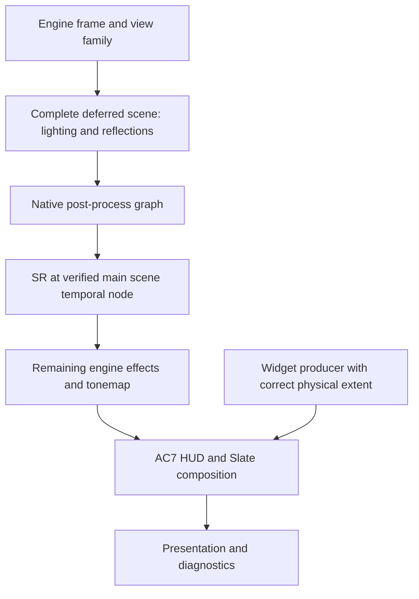

# AC7 renderer ownership audit, 30 September 2026

The question is whether ReScaleFrame can replace draw-pattern discovery and late texture
promotion with the engine's own view, post-process graph and widget producer identity. The
user reported missing reflections and lighting, plus UI that briefly changes size or sharpness.
Walking backwards from the captured consumers revealed a concrete resource-lifetime defect
and native boundaries suitable for the next integration experiments.

This investigation uses the Steam executable SHA-256
`c7da97f5f8a807d4f1264adbb074146fcffe9bdc2ffa98791b822cd28e558f4f`, decrypted image SHA-256
`fafd1db2808d32333caecf4056e8bcd676c2f07e4c1fabc0f270ef29f22d24db`, image base
`0x7ff741350000`, and full UE4.18.3 reference revision `0a14a8d537a31ecc77488ced41dbaa0166612ef8`.
The live CodeBrowser MCP selected `Ace7Game.exe.dump`. Reference source and decompiles remain
ignored. [Sanitized evidence](evidence/ac7-renderer-roots-20260930.json) records native entry
fingerprints and the captured lifetime error.

## Proven lifetime error

The DLSS-on session `motion-20260930-182527-205956-1`, interval 0, contains a base-pass MRT
write to the native 800x452 BGRA8 typeless allocation `0x230893f4ee0` in slot 2. That same
allocation is the tonemap output later in the frame. Promotion treated its late role as if it
applied throughout the frame. The MRT still wrote the original GBuffer, while earlier lighting
and reflection reads were redirected to the 1600x900 replacement `0x230899a2ca0`.

| Consumer | PS CRC32C | Requested input | Actual input |
| --- | --- | --- | --- |
| Lighting | `652391ba` | slot 0, original GBuffer, 800x452 | promoted replacement, 1600x900 |
| Reflection/environment composition | `1ff7837d` | slot 1, original GBuffer, 800x452 | promoted replacement, 1600x900 |
| Later tonemap | `6bcbd787` | original target, 800x452 | promoted output target, 1600x900 |

Reflection shader bytecode actually samples slot 1. This is more than an inherited unused
binding. Its depth and other GBuffer inputs still have render resolution. The mismatched
GBuffer read explains why the reconstructed scene can already lack lighting and reflections
before DLSS runs. Holding a COM reference preserves an allocation, not its role or contents.
These addresses are observations from this process only, not runtime selection constants.

The earlier delayed-evaluation correction (`d83db16`) prevented reconstruction before the
scene finished. It did not gate reads of the promoted composite and chain surfaces. The
comment about MRT protection also exceeded the implementation: only an oversized target
array was refused. The compatibility correction now:

- Keeps composite and chain substitutions closed until the composite's single-target binding.
- Refuses promotion and gate opening at MRT bindings, preserving the complete native GBuffer.
- Calls the gate callback once for all substitutions waiting on a given binding.

The user confirmed that the 19:09 deployment restores lighting and reflections. They reported
returned jitter and shimmer, which remain open. This establishes the measured lifetime fix in
game, not complete temporal image quality. Fourteen new sessions are recorded below.

The synthetic regression binds a pooled composite as a GBuffer first, verifies native writes,
reads and viewport, then verifies its later post-process promotion. This repairs the measured
case, but a single-target binding remains a compatibility heuristic. A future graph-node
identity must replace it if another single-target role precedes tonemapping.

The earlier frozen-input colour experiments in [the colour investigation](ac7-ui-hdr-20260930.md)
remain valid comparisons of their supplied input. They do not prove the game supplied complete
lighting. Attributing the entire on/off difference to preset exposure or model precision was
too broad. Correct the upstream lifetime error before deciding whether a remaining colour-domain
problem requires a different SR insertion point. No preset is forced and no post-tonemap SR
route is implemented by this correction.

## UI producer ownership

The existing resource registry ages UI after 120 Present intervals and rescans the chain after
300, with a further plan rebuild after discovery. That can produce settling after a screen or
size change. The captured flight fullscreen HUD producer also bypassed the earlier quad rule.
These are concrete weaknesses; the exact timing of every pause/resume report is still unmeasured.
Some reporting paths use assumed alpha-blend facts, and inherited SRVs can identify a resource
that the active shader does not sample. Neither is a sufficient ownership contract.

The reflected SDK and native converter code expose the state before the widget is rasterized:

- `UWidgetToTextureConverter`: integer DrawSize at `+0x28`, Widget at `+0x30`, RenderTarget at
  `+0x48`, DownSampleRT at `+0xc0`, BlurX/BlurY at `+0xc8/+0xd0`, RenderTargetWithGlow at `+0xd8`.
- `ANimbusHUD`: HudWidgetConverter at `+0x470`, HudPostProcessConverter at `+0x478`.
- AC7's `UWidgetComponent` extension: downsample enable at `+0x828`, target array at `+0x830`,
  glow target at `+0x840`.

The deeper correction should distinguish logical DrawSize/DPI from physical texture pixels,
then make the producer and its dependent downsample/glow allocations agree with the output
extent. It should preserve layout, refresh scheduling, the game's grade and any real depth
occlusion. Enlarging a late texture cannot recover detail already lost during rasterization.
None of these producer-size changes is installed yet.

## Native roots matched and named

String references supplied leads; callers, distinctive control flow, reflected offsets and
matching engine source established the functions. The names were saved in the live Ghidra
project. The two custom converter names describe behavior; they are not recovered original
method names.

| Name | RVA | Evidence and runtime role |
| --- | --- | --- |
| `AC7_FPostProcessing_Process` | `0xffb900` | Both PostProcessing event strings; four arguments; constructs FinalPostProcessColor. Called once per view with GPostProcessing, RHICmdList, FViewInfo and a velocity reference. Matches `PostProcessing.cpp`'s Process. |
| `AC7_FDeferredShadingSceneRenderer_Render` | `0xef5cc0` | Calls Process at `0xef7d5f` in a per-view loop. Views at renderer `+0xb8`, count at `+0xc0`, stride `0x27c0`; matches the deferred renderer's post-process tail. |
| `AC7_UWidgetToTextureConverter_PrepareSlateWindow` | `0x4d69a0` | Converter source-file reference and Widget/DrawSize fields; creates/resizes cached Slate window and sets its content. |
| `AC7_UWidgetToTextureConverter_QueueWidgetDraw` | `0x4d6340` | Calls preparation, rate-limits updates, reads the render target and queues the widget/glow draw payload. |
| `AC7_AddTemporalAA` | `0xff6ad0` | Creates a `0xe0` main temporal node, connects FinalOutput, history and velocity, then updates FinalOutput at context `+0x28`. |
| `AC7_FRCPassPostProcessTemporalAA_Process` | `0x10aeca0` | Main pixel/compute temporal execution, AsyncTemporalAAEndFence and temporal history update. |
| `AC7_FRCPassPostProcessTemporalAA_ComputeOutputDesc` | `0x1098f40` | Copies input descriptor, forces float RGBA and sets render-target/UAV flags. Same main-node vtable at `0x2ac6a90`. |
| `AC7_FRenderingCompositePassContext_Process` | `0x10b3970` | Gathers output descriptors, then executes required graph nodes. Hidden-area-mask and composition-order logic match source. |
| `AC7_FRenderingCompositionGraph_RecursivelyGatherDependencies` | `0x10b3cc0` | Computes each output descriptor through virtual slot `+0x70`; copies its 80-byte fields before execution/allocation. |
| `AC7_FRenderingCompositionGraph_RecursivelyProcess` | `0x10b3f10` | Recurses dependencies, sets Context.Pass, invokes Process at virtual slot `+0x28`, then releases dependency target references. |
| `AC7_FRHICommandListExecutor_ExecuteInner` | `0x120dea0` | Dispatch/waits and inlined command execution loop; follows Next and calls each execute thunk before resetting the command list. |
| `AC7_FSceneRenderer_PreVisibilityFrameSetup` | `0x112afa0` | Owns the native jitter gate at `0x112b1f3`, previous view matrices and temporal history setup. |

The initial renderer `+0x2e0/+0x300` fields were a decompiler arithmetic error: its first
parameter was inferred as `wchar_t*`, so element offsets `0x5c/0x60` mean byte offsets
`0xb8/0xc0`. Native constructor/loop inspection in the
[frame handoff research](ac7-render-frame-handoff.md) corrects them. The view stride is unchanged.

GPostProcessing is at RVA `0x3c31f00`. These offsets are AC7 build facts, not a reusable Unreal
ABI. The renderer's own prototype still needs calling-site validation before detouring it.
The familiar temporal shader `c618a960` is used in the latest reflection chain: SSR output
`a4d87960` enters it, then reflection composition `1ff7837d` reads its result in slot 12.
It must not be selected as the main scene AA node merely because its inputs look like TAA.

Optional F9 instrumentation now observes post-processing, both converter functions, main temporal
construction/execution and recursive graph execution. It checks the
entry sequences listed in the evidence manifest after decryption, announces installation or
refusal, and rolls back partial installation. It changes no arguments, engine fields or native
decisions. `native.jsonl` contains bounded before/after records with QPC, thread, scope, view,
velocity-reference and converter fields. The three GPU sample intervals also preserve raw
`0x27c0` view snapshots through the existing numbered blob files. Draws record their thread and
thread-local native scope/view if execution happens inside one. CPU scope is not GPU frame
identity; graphics execution outside a scope is explicitly zero.

## New captures and queued execution

Process 220716 produced 14 complete sessions, with 42 paired samples. Images 1-12 show the
hangar aircraft/weapon selector; 13 shows flight and 14 the paused flight view. The
[sanitized evidence](evidence/ac7-temporal-instability-20260930.json) contains file hashes,
native call counts, view rectangles, AA mode and stage extents. Native post-processing and
converter hooks were captured without dropped records. The later main-temporal/graph hooks
were not yet in that build.

Every sampled native view has rectangle 928x524 and AntiAliasingMethod 1 (FXAA), while backend
jitter varies. Native main TAA is not selected by that mode. The render-thread post-processing
scope ends before its tonemap D3D draw, and all sampled D3D draws report native scope zero.
This is true even though both execute on thread 166768. The engine queues graphics work inside
the scope and executes it later; carrying a CPU TLS scope alone would silently lose view identity.

The native jitter pair at FViewInfo `+0xab4/+0xab8`, matched to the pre-visibility source and
instructions, agrees with backend metadata for all 42 samples within `1e-6` pixels. Sampled
camera-cut bytes at `+0xc34` are zero. The new shimmer is therefore not established as a stale
jitter-pair error by these samples. Other input alignment, history, motion conversion and
downstream effects still need validation.

Hangar tonemapping writes 1600x900. Flight tonemapping (`5fb31417`) and the scene effect
(`a5c9147b`) still write 928x524, followed by 1600x900 composition. This is a confirmed remaining
resolution ownership problem, but does not by itself prove the entire shimmer mechanism.
The motion convention discrepancy in the earlier shader investigation also remains unresolved
in the deployed consumer. Do not equate these observations with a tested temporal correction.

The RHI source comparison provides a lower boundary. The native command-list Root is `+0`,
tail link `+8`, UID `+0x18`; each command has Next at `+0` and execute thunk at `+8`.
GCurrentCommand is RVA `0x3c78358`, written at `0x120e67c` with bytes
`48 89 05 d5 9c a6 02` in the matched execution loop. Capture refuses if this instruction differs.
This global can retain the last command outside execution, so it is not sufficient identity alone.

The new read-only graph hook snapshots descriptor name/extent/format, pass/vtable method identities,
pooled-target identity and the native family frame counter before/after execution. It follows the
new commands through their linked list and records a bounded candidate association. Nested child
ownership takes precedence over the parent's broader span. Generation and execute-thunk matching
help detect address reuse. Draw/dispatch records include the observed current command and candidate
producer scope. No command is inserted, redirected or retained. Flushed/reset lists, sublists,
allocator reuse and RHI-thread movement still require runtime validation before this can become a
production frame contract. It establishes neither GPU completion nor Present identity.

The later process-215904 run supplies sampled graph-to-RHI validation: nine complete sessions,
27 paired samples and 1119 matched draw/dispatch records, with no native/command drops. The
[graph capture report](ac7-graph-capture-crash-20260930.md) maps actual Tonemap, FXAA, material,
Nimbus HUD/composite and final upscale functions. The last session captured a pause-menu image
and first backend inputs, then crashed while copying a cached borrowed translucency resource.
The ownership correction, current-frame capture guard and native checkpoint are built and deployed
after Windows MSVC Release verification and real-overlay preflight. The corrected crash scene
still needs game validation. A production frame contract and native graph migration remain open.

## Engine-owned integration

This is the target ownership model, not a claim that the current SR node has migrated. Preserve
measured cloud, transparency, depth, DOF and reflection-history ordering when selecting the
node. The game plugin should own:

1. Engine frame/view-family and view index, view rectangles and scene-capture/UI roles, carried
   through the RHI handoff. Present counters and global dimension matching are insufficient.
2. The actual main scene temporal graph node, its FinalOutput inputs and history. Preserve SSR
   and other independent temporal passes. Identify the node from engine construction and callers.
3. The output pooled-target descriptor and valid rectangle. Downstream allocations and constants
   must derive from that output while depth/motion retain explicitly declared render extents.
   This removes API viewport scaling and uploaded-constant rewriting.
4. Widget producer generations and physical target extents, while preserving logical layout,
   converter updates, downsample/glow dependencies and real occlusion.
5. The game's colour, exposure and grading order. SDR presentation can still have a floating-point
   HDR scene input. Driver preset selection must not be a correctness dependency.

The orchestrator continues to own vendor contexts, GPU interoperability, fallback, settings and
presentation. AC7 engine types remain private to the plugin; a bounded POD contract carries
frame/view metadata and scoped resource handles across the C ABI. The graphics observer remains
useful for evidence and copies, without choosing engine semantics.

The next steps are to validate these native graph/command records against the RHI timeline, then
replace the main temporal node's input/output handoff and downstream descriptor ownership.
Migrate the UI producers separately and retire resource heuristics after equivalent
captures establish continuity. Expected-byte guards and announced refusal remain required for
native changes. Public plugin `rendering_ready` remains 0 until that lifecycle works.

Acceptance requires intact GBuffer/lighting/reflections before SR; matching current-frame colour,
motion, depth and view; correct output rectangles on the first frame of a transition; stable UI
without discovery delays; preserved post-processing; and safe native fallback. Native entry
matching, successful compilation and synthetic tests do not establish game image quality.
