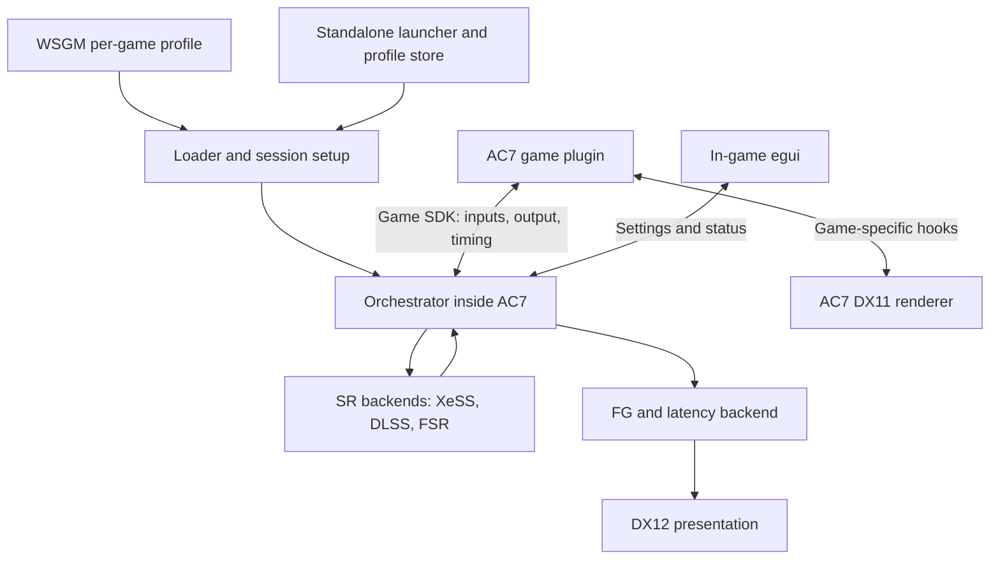

# Architecture and implementation approach

This document distinguishes inspected behavior from proposed implementation. Source anchors and exact revisions are in [source-map.md](source-map.md). The names below are working component labels, not repositories already created or final product names.

## 1. Ownership and process boundaries

The design uses one monorepo with explicit component responsibilities. The current loading graph is maintained in [the design](../design.md).

| Component | Owns |
| --- | --- |
| Loader | Early loading into the selected game, launch-session identity, bootstrap handshake, and loader diagnostics |
| Orchestrator | DLSS/FSR/XeSS, capability checks, frame sequencing, GPU resource handling, DX11/DX12 interoperability, latency SDK calls, presentation, settings application, and telemetry |
| Game SDK | The versioned contract between the orchestrator and game plugins |
| AC7 plugin | AC7 executable recognition, engine hooks, renderer preparation, input extraction/conversion, render-resolution integration, camera resets, HUD boundaries, and reinserting reconstructed output |
| Standalone application | Independent launch/profile management and runtime communication |
| In-game egui | Runtime settings and diagnostics through the shared command/status contract |
| WSGM adapter | WSGM application identity, profile policy, launch integration, QAM/overlay settings, and coordination with frame limiting and AutoTDP |

The orchestrator and active game plugin run **inside the game process**. Vendor SDKs operate on GPU resources there. A frontend process sends configuration and receives bounded status over IPC; it does not receive textures or run a per-frame graphics loop.



The plugin returns the reconstructed scene to the game's post-processing. The orchestrator owns the final swap-chain presentation. This separates two different meanings of “get the data back”: returning SR output to the renderer, and displaying completed/generated frames.

Do not put AC7 signatures, Unreal structure offsets, shader hashes, or game-specific cloud fixes in the orchestrator. Conversely, the AC7 plugin must not create its own XeSS context, call a competing frame generator, or independently own the swap chain.

Game-specific decoding belongs to the plugin, using shared shader/resource helpers supplied by the host. For example, decoding AC7's packed velocity is game knowledge; allocating a shared texture and scheduling its copy is graphics infrastructure.

## 2. Launcher first, shim fallback

Special K's README calls global injection its preferred technique. Its payload installs a `WH_CBT` hook and supporting hooks, while SKIF starts and stops the injection host through `RunDLL_InjectionManager`. The goal is early entry before graphics/swap-chain initialization. This is materially different from polling for a process and injecting after it has begun rendering.

Recommended loading design:

1. A frontend resolves the selected executable, plugin, and immutable initial settings snapshot.
2. The loader arms an x64 early-loading mechanism before asking Steam to launch, or before a controlled direct launch resumes.
3. A small bootstrap checks the target identity. Only a matching process loads the orchestrator, game plugin, and vendor runtimes.
4. The orchestrator establishes graphics interception before the relevant device/factory/swap-chain call returns to the game.
5. It publishes a handshake containing the actual process identity, API, adapter, plugin, settings revision, and readiness state.
6. A launch timeout or unsupported build yields an explicit unmodified-game outcome. If the game has already started, a failed handshake must never launch a second copy.

For Steam-started games, investigate a Special K-style hook host first. A desktop-wide Windows hook can cause its small bootstrap DLL to load in unrelated processes even when the full runtime is allowlisted. Document that distinction. Keep the bootstrap small, validate exact paths and session identity, chain callbacks, and remove the host hook when its service lifetime ends. The hook host must keep pumping messages. User opt-in, x64 support, integrity matching, and early initialization are part of the product mechanism.

For a directly controlled child, a suspended launch gives a deterministic point to establish containment and bootstrap loading. It should use the same session contract as the Steam path. Do not assume that a launcher owns the final game process: Steam and other launchers can spawn another executable.

The loader must handle initialization safely around Windows' loader lock. Keep `DllMain` minimal; do not create graphics devices, wait for worker completion, or initialize SDKs there. Also do not defer every essential interception to an unsynchronized worker and assume it will beat the game. Establish the early gate and perform heavier initialization on a safe intercepted boundary, with recursion protection. Prove event ordering with a startup trace.

A `dxgi.dll` frontend remains useful for diagnosis and games that cannot use early injection. It forwards required exports to the system DXGI and activates the same runtime. Export forwarding alone is not enough: interception must cover `CreateDXGIFactory*`, the relevant factory methods, and `D3D11CreateDeviceAndSwapChain` when used. The game may obtain DXGI through routes outside its direct imports.

Late attachment can support limited diagnostics. Do not promise full MFG activation after AC7 has already retained a native DX11 swap chain. Require a relaunch unless a separately proven migration path exists.

## 3. Game SDK and independent plugins

Mirror the Device SDK's principles: a small dependency-light contract, strict API versioning, a package manifest, explicit detection/start/stop, capability reporting, semantic commands, and honest failure reasons.

Do not copy its managed implementation literally. WSGM's Device SDK uses .NET type identity and a collectible assembly context. A plugin running inside a C++ game should use a native **C ABI** with opaque handles, size/version fields, fixed-width types, and function tables. C++ classes, STL containers, Rust objects, allocators, and exceptions must not cross that boundary.

Proposed package identity fields are `id`, `name`, `version`, exact SDK API version, architecture, package-relative entry DLL, and entry export. Keep detection rules and feature policy in plugin code or fixed package data. An optional non-executable discovery index can shortlist games, but the plugin's read-only detection remains authoritative. Many game packages may be installed; one selected game plugin owns each target process. Do not run every installed plugin in AC7 to see which one works.

Proposed lifecycle:

`Detect -> Prepare -> Start -> Active -> Quiesce -> Stop`

- **Detect:** inspect the executable/module fingerprint and return supported, unsupported, ambiguous, or incomplete. No engine patches or GPU work.
- **Prepare:** resolve and validate required hook sites, describe available inputs, and negotiate the requested SR/FG/latency combination.
- **Start:** install the approved hooks and publish readiness. Partial initialization must unwind the hooks and resources it acquired.
- **Active:** supply rendering events and accept validated settings changes at defined boundaries.
- **Quiesce:** stop admitting new callbacks and retire in-flight work before releasing resources.
- **Stop:** restore owned changes during a safe shutdown path. First release should disable effects without attempting arbitrary mid-game DLL unloading.

Read-only detection does not mean the loader can run untrusted plugin code safely. These are native in-process plugins, not a sandbox. Package validation and hashes establish identity and integrity, not isolation.

The SDK needs two surfaces:

| Surface | Required data or behavior |
| --- | --- |
| Host services | Logging, settings snapshot, feature capabilities, graphics-device references, resource allocation, hook registration/lifetime helpers, and bounded diagnostic publication |
| Game callbacks | Begin frame before input, simulation end/render handoff, render submission boundaries, upscale opportunity, post-process/HUD capture opportunity, present association, resize/reset, and shutdown |

The plugin invokes host processing at the real game boundary. An SR call must synchronously return a usable output texture/status for that render-thread invocation, not queue it to a general worker and return early.

Each frame descriptor needs:

- A monotonic session frame ID and resource generation, plus the game view/frame identity used to associate game, render, and RHI threads.
- Device/API/adapter identity, context or command-list identity, and the declared current thread/phase.
- Input/output dimensions and valid rectangles. Allocation size and viewport size are different.
- Scene colour, depth, motion vectors, jitter, exposure/pre-exposure policy, camera matrices, reset reason, and optional masks.
- Explicit motion-vector direction, units, camera-motion inclusion, jitter inclusion, and dilation state.
- Explicit depth convention and colour space.
- Resource ownership, ready ordering, valid-until boundary, and output insertion contract.
- Per-frame interpolation eligibility and the availability of HUD-less and UI-only colour.

Use a negotiated requirements structure instead of the lowest common denominator across vendors. Missing depth, timing, or HUD data should disable the affected capability with a reason, rather than silently inserting fabricated values. A shared optional Unreal helper library can emerge after a second game establishes which parts are reusable; it must not become a mandatory UE4SS/UEVR dependency.

## 4. Recommended AC7 graphics path

### Vendor backends and Streamline

Streamline can be part of this project, but it should not define the Game SDK or be mistaken for a ready-made bundle of all three vendors' complete SR/FG integrations. Its inspected 2.12.0 tree exposes NVIDIA features and a DirectSR integration; the latter is DX12-only and addresses super resolution, not our full MFG and latency requirements. It does not replace direct Intel XeSS-SR/FG/XeLL integration.

This describes NVIDIA's upstream tree. The subsequently inspected Community Shaders fork adds Vulkan XeSS-SR and FSR plugins. It is a useful alternative backend reference, but its XeSS plugin is explicitly SR-only. See [presentation-backends.md](presentation-backends.md) for the fork comparison and Vulkan/DX12 decision. XeSS-SR does support Vulkan; the current DX12-only limitation concerns XeSS-FG/MFG and XeLL.

Use three backend families behind the orchestrator's own interface:

| Family | Proposed integration |
| --- | --- |
| Intel | Direct XeSS SDK for SR, FG/MFG, and XeLL; native DX11 SR on the Claw and DX12 presentation |
| NVIDIA | Streamline for DLSS and the associated supported FG/latency features; evaluate its manual-hooking path to keep interception under one owner |
| AMD | Direct AMD FSR/FidelityFX APIs for supported SR and FG implementations |

The current AMD reference identifies SDK 2.3.0 and separate conventional/ML upscaling, interpolation, and swap-chain components. Those components have different capability requirements. Do not treat an FSR family name as a guarantee that its newest implementation runs on every GPU, or that a temporal DX11 backend comes with the official DX12 implementation. Source ports used by mods are separate dependencies that need their own review.

Keep SR selection separate from FG selection in the settings model, with a capability matrix approving actual combinations. For example, Intel's SDK makes XeSS-FG dependent on XeLL, while SR is independently selectable. The architecture can accommodate mixed-vendor combinations; each combination still needs input, device, latency, licensing, and presentation validation. Only one backend may own frame generation/presentation at a time.

Backend capabilities should report supported graphics APIs, devices, formats, required inputs, available interpolation counts, latency requirements, and restart conditions. Optional vendor runtimes should be loaded only for a selected supported path. Their absence must not prevent another backend or plain game rendering from working.

### Native DX11 SR plus DX12 MFG

Intel's SR guide documents native DX11 support for Arc and states that only the Intel-optimized implementation is available there. That is the intended XMX route for the Claw; successful initialization and device checks still need validation on the actual unit.

The preferred first implementation keeps AC7 and XeSS-SR on their existing DX11 device. It creates a DX12 device on the **same adapter LUID**, then bridges completed frames and FG inputs to a DX12 presentation provider. This avoids an extra DX11-to-DX12-to-DX11 round trip halfway through rendering merely to perform SR.

```mermaid
sequenceDiagram
    participant G as AC7 plugin / engine
    participant O as Orchestrator
    participant S as XeSS-SR DX11
    participant P as DX12 bridge + XeSS-FG
    G->>O: Frame start before input
    O->>O: XeLL sleep, simulation-start marker
    G->>O: Correct simulation/render boundary events
    G->>O: TAA inputs and requested larger output
    O->>S: Reconstruct on game's DX11 device
    S-->>G: Output texture for post-processing
    G->>O: Post-processed HUD-less scene; then final HUD frame
    O->>P: Shared colour/depth/motion + matching frame constants
    O->>P: Tag resources, set present ID, present once
    P-->>G: Return after source-frame submission
    Note over P: SDK schedules generated frames and presentation
```

A DX12 XeSS-SR backend is still useful for the development laptop, other vendors, or a future unified processing path. Benchmark it against native DX11 on the Claw before choosing it as the default. API uniformity alone does not establish lower overhead.

### Why AC7 needs more than replacing a DLL

AC7 uses a customized UE4.18 branch. Epic's later temporal-upsample design dates to UE4.19. Do not assume a modern `ITemporalUpscaler` extension or a `r.TemporalAA.Upsampling` setting is present in the shipping binary.

The authorized Epic 4.18.3 source and installed AC7 build have now been inspected. [ue418-hook-map.md](ue418-hook-map.md) records concrete source boundaries, the game fingerprint, and candidate strings. It confirms that stock input polling precedes `UGameEngine::Tick`, and that spatial upscaling can be merged into tone mapping. These are source/file findings, not resolved runtime hooks.

Luma demonstrates a promising interception route: classify TAA shader candidates, inspect resource bindings, find projection/previous-frame data in constant buffers, and replace the TAA operation. Its generic Unreal code sets scale to 1.0. It does not prove the larger-output reinsertion needed here.

The AC7 plugin must establish the following on the actual build:

1. Enable or identify the temporal path and its camera jitter without leaving a second temporal AA pass after XeSS.
2. Select a lower internal render size from `xessGetOptimalInputResolution`; do not hardcode historical quality ratios.
3. Produce a larger output at the intended temporal-processing boundary.
4. Update the specific downstream render targets, view rectangles, shader constants, and resource bindings that consume it.
5. Remove or neutralize the original spatial upscale where needed so the result is not scaled twice.
6. Keep HUD rendering at the chosen display resolution.

Start by tracing the existing screen-percentage path. Prefer a targeted engine-level change to the TAA/output contract. If that cannot be established, investigate a targeted shader/resource redirection that upgrades the necessary downstream passes. Blindly enlarging every texture created by `CreateTexture2D` is not a valid substitute. Moving XeSS to the very end of post-processing also changes its inputs and quality assumptions; that is a separate experiment, not an equivalent implementation.

For first diagnosis, keep SDR and the game's current aspect ratio. The Claw's 16:10 panel does not require widescreen patching to prove MFG. Native-aspect rendering and letterboxing must be represented explicitly in the frame rectangles; full 16:10 support can be a separate game-plugin feature.

### Motion, depth, clouds, and HUD

UE motion textures may contain packed object motion while camera motion is reconstructed in TAA. Luma's decoder combines both. Copying the velocity SRV directly to XeSS without checking its encoding would be wrong. Inspect stationary-camera object motion, camera-only motion, combined motion, sky pixels, and invalid/sentinel pixels.

SR and FG should not blindly share the same processed velocity texture. The inspected Luma shader dilates motion using nearby depth. Intel's FG guide recommends low-resolution **undilated** motion and performs its own dilation; high-resolution motion is expected to be dilated. The SDK contract must express that distinction, and the orchestrator must request the representation its selected backend needs.

Flatten camera/object motion on the GPU, with per-game decoding in the plugin's shaders. Do not read back the whole depth or velocity buffer every frame. Camera constants can often be observed as the game updates/maps constant buffers, but the current update path must be captured before relying on that approach.

trueSky clouds, cockpit glass, rain, smoke, and fast target markers are AC7-specific quality risks. Existing VR support does not prove they supply valid temporal inputs. Test their ordering and motion coverage. Responsive masks may help SR if the chosen SDK path supports them; they are not a universal repair for absent geometry motion or a misplaced pass.

Capture an FG HUD-less scene after post-processing, in the same dimensions, format, and colour space as the final back buffer. The pre-tonemap colour supplied to SR is not interchangeable with this image.

Use Intel's `BACKBUFFER_HUDLESS` composition mode for the first complete MFG experiment if we can obtain a clean scene but not a reliable UI texture. Then add UI-only capture and evaluate `BACKBUFFER_HUDLESS_UITEXTURE`, which Intel identifies as appropriate for Unreal-style compositing. Semi-transparent markers and additive UI need visual verification. Do not assume that subtracting the two colour images recovers correct UI alpha.

UEVR/UESDK provide references for engine tick, view families, and Slate render boundaries. Slate alone might not include every HUD element, so identify the first actual AC7 HUD pass. The ultrawide mod's shader hashes are leads for HUD identification and must be revalidated against the installed build.

## 5. Presentation, MFG, and XeLL

### DX11-facing swap-chain contract

Create a facade that returns DX11 resources to AC7 and owns a DX12 swap chain internally. Skyrim and Fallout 4 Community Shaders illustrate this pattern. Microsoft documents that DX12 swap-chain creation receives a command queue; a native DX11 swap chain cannot simply be handed to XeSS-FG as though it were DX12.

The facade must preserve the interfaces AC7 actually queries: COM identity and reference counts, `GetDevice`, `GetBuffer`, descriptors, presentation, resize, window/fullscreen behavior, and error results. Do not expose the inner DX12 object through an unhandled `QueryInterface`, which can bypass interception or return the wrong device type. Implement observed newer swap-chain interfaces when required; do not advertise unsupported ones.

Intercept before creation so one real presentable swap chain owns the game HWND. A swap chain is not a second overlay window. Use flip-model presentation where required and translate the game's outward contract deliberately, including a stable DX11 back buffer if it retains buffer zero.

Start with same-adapter shareable colour/motion/depth-copy textures and GPU fences. Many game textures cannot be opened directly by DX12. Copy or convert selected resources into owned shareable allocations instead of changing every game texture's flags.

On each source frame:

1. Finish the DX11 writes needed by MFG, signal the shared producer fence, and ensure those commands have been submitted. A CPU signal is not a substitute for GPU readiness.
2. Make the DX12 queue wait, perform copies/conversions and transitions, and tag inputs with their real state and lifetime.
3. Set the matching present ID, then call the XeSS proxy's `Present` once for the rendered frame.
4. Retire shared input slots only after the applicable SDK lifetime and cross-queue fences permit reuse.

For the initial mixed-API implementation, prefer `RV_ONLY_NOW` tagging where the additional copy simplifies lifetime correctness. It records copies into our command list; the DX11 producer must wait for that copy work to finish before reusing a shared allocation. `RV_UNTIL_NEXT_PRESENT` can avoid some copying, but its lifetime extends to the matching present. A `Present` return is not proof that all physical scanout is finished, and a game-queue fence must not be assumed to cover every SDK-owned queue. Optimize only after validating the documented ownership contract.

Use a small bounded ring whose slot reuse is fenced, and measure memory/latency. Do not equate “4x MFG” with “four application frame slots.” Handle `DXGI_PRESENT_TEST`, minimization, resize, device removal, loading, and camera cuts without advancing fabricated simulation frames.

### MFG controls

At initialization query `maxSupportedInterpolations`, or initialize with `XEFG_SWAPCHAIN_USE_MAX_SUPPORTED_INTERPOLATED_FRAMES` and query the resulting configuration. Reserve the intended maximum and use `xefgSwapChainSetNumInterpolatedFrames` for a supported user-selected count.

| UI setting | Generated frames per rendered frame |
| --- | --- |
| Off | Disable interpolation through the SDK |
| 2x | 1 |
| 3x | 2 |
| 4x | 3 |

The inspected SDK's count setter accepts one through the configured maximum; Off is not a zero-count call. Changing the allocation maximum requires reinitialization. Count changes can trigger model/shader work, so do not call the setter every frame. Intel Graphics Software can override limits/settings; report the effective capability and actual presentation status.

Read `xefgSwapChainGetLastPresentStatus` to distinguish requested interpolation from frames actually queued/presented by the SDK. Report the application's rendered FPS separately from the estimated post-FG presentation rate. Neither counter alone proves physical scanout cadence.

### Latency and frame identity

XeLL requires sleep before input sampling, then simulation, render-submit, and present marker pairs with consistent frame IDs. A collection of markers emitted beside `Present` cannot describe the simulation timing.

The AC7 plugin must identify the outer frame/input boundary and the game-to-render/RHI handoff. `UGameEngine::Tick` is a candidate, not a guarantee that it precedes all input sampling. `FEngineLoop::Tick` discovery in patternsleuth provides another lead. Confirm ordering in a trace before using either for sleep.

Game, render, and RHI threads can overlap and have a frame of lag. Carry an explicit token with the real frame handoff. Do not assume the most recent game-thread ID belongs to the next present. Missing or ambiguous associations should suppress interpolation for that frame and produce bounded diagnostics.

The official XeLL API is DX12. Our game is DX11 with a DX12 presentation queue. Source references make this a plausible architecture, but they do not establish that XeLL optimally observes all DX11 work. Testing marker validity and end-to-end latency on the Claw is a decisive experiment. A successful context creation is insufficient.

Allow only one FG presentation owner and one active latency/limiter policy. Backend changes that require a new swap chain are restart-required initially. Do not stack Reflex and XeLL or two frame-generation proxies.

## 6. WSGM and standalone integration

WSGM already has canonical per-application identity, stored per-game overrides, launch wrapping, and a running-application coordinator. Keep that identity instead of creating a second executable-name-only profile system.

Use the launch wrapper or an already armed loader service for early activation. `RunningApplicationCoordinator` observes running targets and is useful for status, profile projection, and cleanup; it is too late to be the sole injection trigger.

The WSGM source snapshot inspected for this research is `2bfe58f09a3457a8372a1d75a739a986bbbd26a6`. Validate these integration points again when implementing against the delivery branch:

- `src/WSGM/Core/LaunchWrapperCommand.cs`: real Steam titles use `%command%`; non-Steam shortcuts use a different target/argument route.
- `src/WSGM.Launch/Program.cs`: environment, de-elevation, process-tree lifetime, and error/exit semantics.
- `native/SteamInput/crates/steam-input-lease/src/lib.rs`: the input-lease route already creates a child suspended, assigns containment, then resumes it. Extending only the managed `Process.Start` path would miss this route.
- `src/WSGM/Core/AppConfig.cs`: canonical application identity and `UsePerGameProfile` behavior.
- `src/WSGM/Shell/RunningApplicationCoordinator.cs`: runtime association, not prelaunch interception.
- `src/WSGM/Shell/AutoTdpService.cs`: currently consumes RTSS mean frametime and a target frametime.

The rendering loader should remain a separate reusable component. WSGM orchestrates it without turning the graphics feature into a device plugin or embedding GPU SDKs in its UI process. Device Integration off must not disable game upscaling.

Proposed profile settings: enabled, game-plugin identity/version policy, SR backend and quality, FG backend and requested multiplier, latency policy, output sizing policy, and explicitly game-specific options. Capability availability comes from the active runtime, not the profile's stored wishes.

Use a versioned same-user local command/status channel. Include process start identity as well as PID, session nonce, and configuration generation. Commands return accepted/applied/restart-required/unsupported results. Keep per-frame GPU work out of IPC; publish aggregate telemetry at a bounded rate.

When XeLL controls pacing, coordinate WSGM's RTSS limiter and the game's limiter so they do not compete. Preserve and restore the previous effective policy. AutoTDP must consume rendered-frame timing and an appropriate rendered target. Multiplying a 30 FPS simulation to 120 displayed FPS must not convince AutoTDP that the underlying game can sustain 120 real FPS. WSGM's generated-frame-aware integration is part of completion, not a cosmetic counter change.

Standalone uses exactly the same loader, orchestrator, game plugins, and settings schema. It supplies its own profile store and an in-game egui frontend. WSGM mode uses WSGM as persistence authority; the in-game frontend can send the same setting intents through the session controller. If that controller disappears, retain the last applied snapshot and expose disconnected status. Do not let two independent stores continually overwrite each other.

### egui implementation

Use egui inside the existing game window, rendering to an owned UI texture. Its integration accepts input and emits meshes and texture updates; it does not require adopting a complete application framework.

A practical implementation split is C++ for the graphics orchestrator/AC7 plugin, and a small Rust static library for egui behind a C ABI. The launcher can use Rust or another suitable native implementation. No CLR needs to be loaded into AC7. This is a recommendation, not an established language decision.

The inspected `egui-directx11` renderer is version `0.13.0+egui-0.35.0` and pins egui 0.35.0, while the main egui checkout is newer. Pin compatible versions rather than combining their current heads. That renderer expects gamma-space, non-sRGB-viewed render targets and explicitly leaves pipeline-state restoration to the caller. These matter for blending with AC7 and MFG.

Use the game's HWND and our existing DX11 device/context. Save/restore affected graphics state. Map keyboard, mouse, touch, DPI, and controller navigation deliberately; egui availability does not itself provide a handheld-ready controller UI. Capture input only while the menu owns it, and release capture on focus loss. Avoid creating another swap chain through a default windowing framework.

Keep the settings UI out of the interpolated scene. Composite it through the orchestrator's UI path, after HUD-less capture, and include it in the UI resources given to MFG as appropriate. Reusing the same sharp UI on generated frames is preferable to interpolating text. Open/close behavior and alpha blending are validation cases, not assumptions.

## 7. Code reuse and scope

The source comparison supports using small pieces and documented approaches rather than forking an entire modding framework.

| Reference | Use | Boundary |
| --- | --- | --- |
| OptiScaler | Vendor adapters, input/output separation, native DX11 XeSS, DX12 FG, capability handling | Existing upscaler inputs do not supply AC7's missing engine integration |
| Streamline / AMD FSR SDK | Official NVIDIA and AMD backend contracts | Neither replaces the AC7 plugin or the direct Intel backend |
| Skyrim Community Shaders | DX11/DX12 resources, swap-chain facade, engine-aware upscaling | Skyrim engine types and assumptions remain outside the orchestrator |
| Fallout 4 Community Shaders | Another concrete presentation bridge, resource lifetime, game anchors | Its README explicitly describes WIP paths and limited validation |
| Luma | TAA detection, constant buffers, UE velocity decoding | Generic path is native-resolution AA; license is custom, not plain MIT |
| UEVR / UESDK | Engine and render-target discovery, camera/view/Slate boundaries | UEVR's inspected license says all rights reserved; no general copying permission established |
| UE4SS / patternsleuth | Object/signature discovery and frame-loop anchors | Research tools/helpers, not required runtime frameworks |
| ac7-ultrawide / AC7 UEVR plugin | Known shader/camera/viewport behavior | Validate all signatures against the current game build |
| Special K / SKIF | Early-loader design and frontend/payload separation | Do not adopt the entire system-wide feature surface |
| ReShade / 3Dmigoto | DX11 interception, COM handling, shader inspection | Optional diagnostic tools; no dependency on their mod runtime |
| RTX Remix | Renderer interception and scene reconstruction ideas | Its D3D9 fixed-function renderer replacement is outside the AC7 DX11 plan |
| Intel SDK / Inspector | Supported APIs, data contracts, MFG controls, diagnostics | Actual DLLs and Claw validation still needed for execution |
| Intel UE plugin | Supported engine-integrated ordering and settings reference | Editor/project plugin is not directly loadable into a cooked UE4.18 game |

Licensing observations are from the inspected files, not a complete legal compatibility review. Luma adds a commercial-use permission condition. UEVR provides no general reuse grant in its current LICENSE, and no separate permissive grant was established for UESDK. OptiScaler and Special K have GPL terms; Community Shaders projects add their own exceptions. SKIF has MIT terms. ReShade uses a BSD-style license. UE4SS is MIT; patternsleuth declares MIT OR Apache-2.0. The egui components offer MIT/Apache licensing. Intel runtimes have separate binary redistribution terms and are not open-source implementations.

ReScaleFrame uses MIT for the Game SDK and GPL-3.0-only for its runtime and game plugins. Check the actual terms of any incorporated reference code or vendor dependency. A linking exception in one repository does not automatically cover another dependency. Preserve vendor DLLs unchanged and ship applicable notices.

Keep the first scope Windows x64, AC7, Intel SR/MFG/XeLL, and SDR. The orchestrator can define backend boundaries for DLSS and FSR now without requiring every vendor/API combination to ship with the first AC7 version. MFG remains part of the first complete AC7 target.

## 8. What is proven and what is next

This is source-level feasibility research. No AC7 capture, injection, SDK execution, performance measurement, or Claw test was performed for this project. Other GPUs can support loader, plugin, presentation, and cross-vendor experiments, but cannot prove the Claw's XMX path or Intel-only 3x/4x MFG.

The recommended next work is three bounded prototypes: early loading and AC7 observation, a synthetic DX11/DX12 XeSS MFG bridge, and AC7's higher-resolution SR reinsertion. They share the proposed SDK from the start. See [validation-plan.md](validation-plan.md) for acceptance criteria and the order that exposes the largest risks early.

Additional primary references: [Microsoft Windows hooks](https://learn.microsoft.com/en-us/windows/win32/api/winuser/nf-winuser-setwindowshookexw), [DLL initialization rules](https://learn.microsoft.com/en-us/windows/win32/dlls/dynamic-link-library-best-practices), [DX12 swap-chain creation](https://learn.microsoft.com/en-us/windows/win32/api/dxgi1_2/nf-dxgi1_2-idxgifactory2-createswapchainforhwnd), [shared fences](https://learn.microsoft.com/en-us/windows/win32/api/d3d11_4/nf-d3d11_4-id3d11device5-opensharedfence), [Epic's screen-percentage history](https://dev.epicgames.com/documentation/unreal-engine/screen-percentage-with-temporal-upsample?application_version=4.27), and [Intel's XeSS 3 overview](https://www.intel.com/content/www/us/en/developer/topic-technology/gamedev/xess.html).
